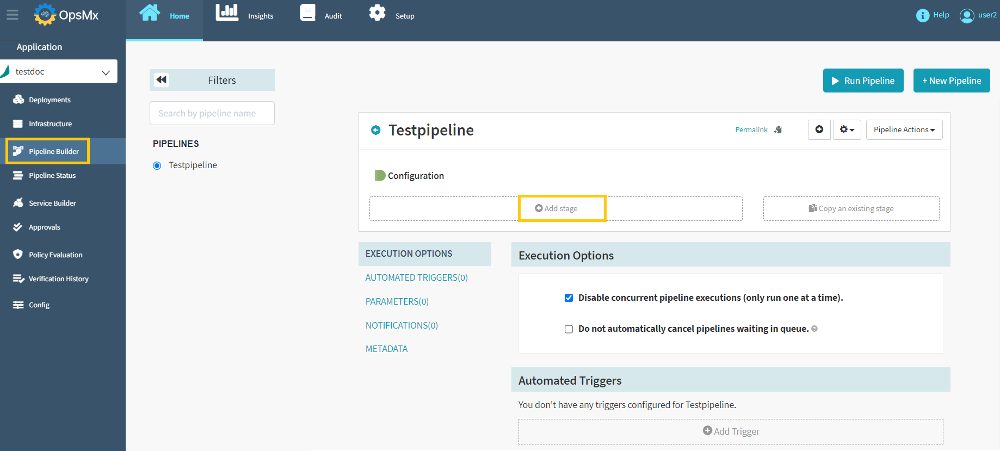
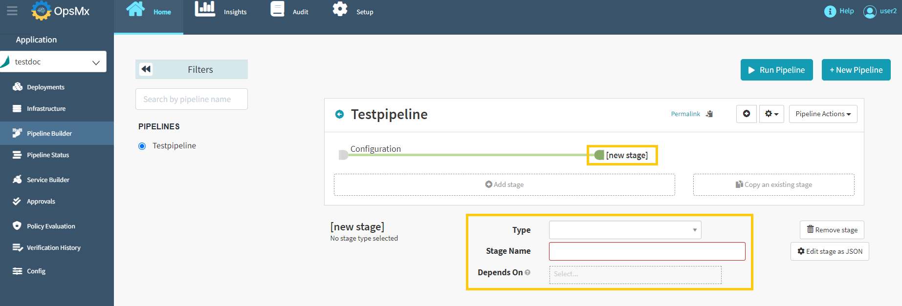
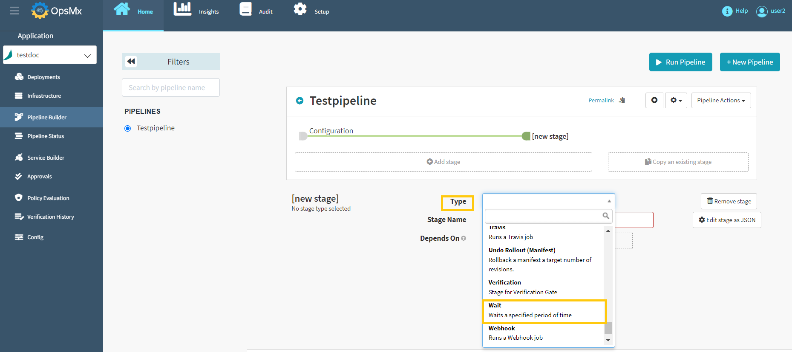
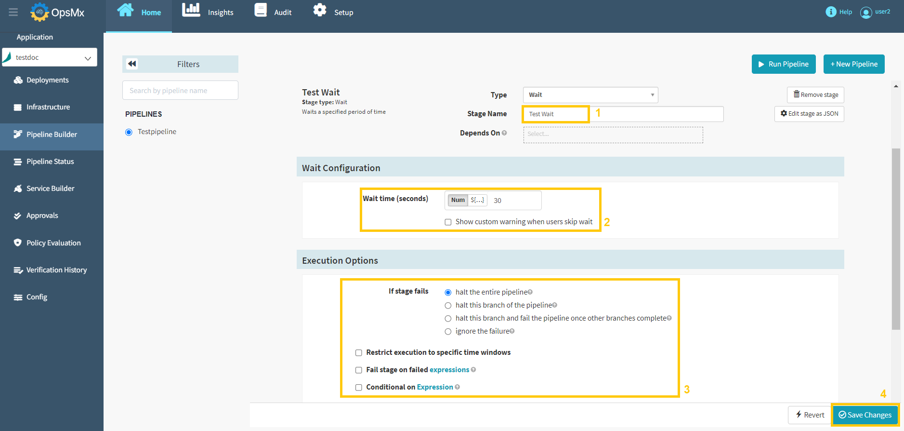

#**Add Stage**#

You have now created a blank pipeline, as described in the previous section. After creating the pipeline, you need to add a stage to it. A stage in a pipeline is the set of actions you want the pipeline to take while executing it.

The first stage of any pipeline is the configuration stage in which you can add a stage and set up the parameters. Follow the steps below to add the first stage.

1. From the Pipeline builder page, click "**Add Stage**" button to add a stage for the specific pipeline.

	

2. When you click the "**Add Stage**" button, you can select many different types of stages that ISD supports.

	

3. Select the stage type as "**Wait**" from the drop-down menu and the configuration options will be displayed.

	

4. After selecting the stage type, provide the "**Stage Name**" and enter the "**wait time(In Seconds)**" and select the “**Execution option**” and then click "**Save Changes**".

	!!! Note
    	Configuration options may differ depending on the stage selected. We've shown an example of the "Wait" stage here.

	

Now the “**Wait**” stage is added successfully. You can add as many stages in the pipeline as needed, in any order, as per your requirement. Next, we'll look at how to **add a trigger** and **run a pipeline** to it.
