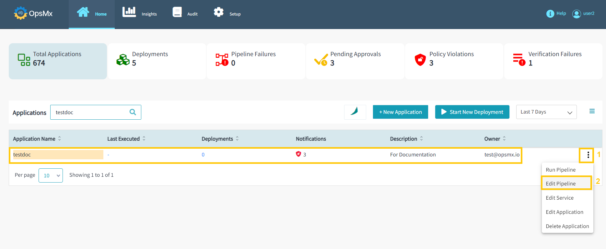

#**Add Test Verification Gate**#

A gate is an access point that allows you to stop the pipeline to automatically go to the next stage. 
A gate helps you to manually intervene and verify or approve a stage of the pipeline before moving on 
to the next stage in the sequence. Adding a Gate in ISD allows you to either automate your pipeline 
based on data from supported data sources. 

There are four types of gates you can add:

* Approval
 
* Verification
 
* Test Verification
 
* Policy

##**Test Verification Gate**##

An approval gate stops the pipeline and waits for approval either from a human user or from a computer based on data from a supported plugin.

You can add a **Test Verification** Gate after creating a pipeline to the application. To add a **Test Verification Gate** follow the steps below:

If you haven’t created an application already,  click [here](https://docs.opsmx.com/user-guide/manage-application/create-an-application).

If you haven’t created your pipelines yet, click [here](https://docs.opsmx.com/user-guide/manage-pipelines/create-a-pipeline).

1. From the Application dashboard, select your application name which you need to edit a pipeline. Click "**Three dots**" at end of the application name and then select "**Edit Pipeline**" as shown in the image below.

	

2. It will redirect you to the "**Pipeline Builder**" page, where you can modify your pipeline by selecting it from the left-hand side. Users can modify the available pipeline within the application as shown below.

	

3.  Select your pipeline, where you need to add the Test Verification Stage. Click "**Add Stage**" and then select the type "**Test Verification**" from the drop-down menu as shown in the image below.

	

4. Next, you get the option to configure the Test Verification gate as shown in the image below:

	

5.   Update the Test Verification configuration attributes as described below on the above screen and click "**Save Changes**"

	* **Gate URL**: Please enter the Gate URL

	* **Life Time Hours**: Please enter the Life Time in Hours like 0.5

	* **Minimum Canary Result**: Please enter the Minimum Canary Result

	* **Canary Result Score**: Please enter the Canary Result Score

	* **Log Analysis**: Please Enable Log Analysis with true / false

	* **Baseline Start Time**: Please select Baseline Start Time

	* **Canary Start Time**: Please select Canary Start Time

	* **Test Run Key**: Please enter the Test Run Key

	* **Baseline Test Run Id**: Please enter the Baseline Test Run Id

	* **New Test Run Id**: Please enter the New Test Run Id

	* **Test Run Info**: Please enter the Test Run Info

	* **Gate Name**: Please enter Gate Name that is created in OES

	* **Image Ids**: Please enter the Image IDs

