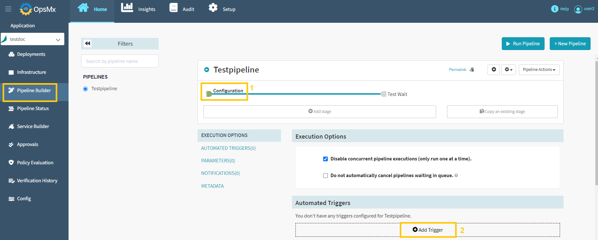
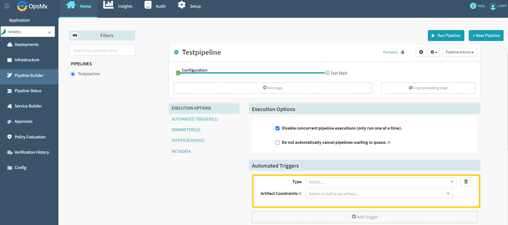
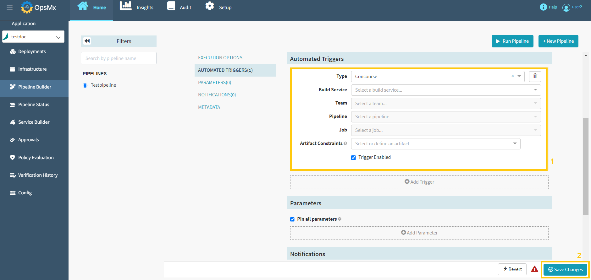

#**Add Trigger**#

A trigger is a mechanism in a software application that indicates the completion of a particular process and then initiates the next process.

A CI-CD pipeline is a set of tasks that are executed in a specific order. Triggers play an important role in automating and enhancing the capabilities of these pipelines.

A pipeline trigger specifies when a pipeline should be run automatically. Many types of triggers are available such as Jenkins jobs, webhooks, CRON jobs, and even other pipelines. When you add a trigger to your pipeline, it means the pipeline will run whenever the triggering event occurs. It is worth noting that whether or not you have set up a pipeline trigger, you can always run your pipeline manually.

Follow the steps below to add a trigger:

1. Make sure you are editing the **Configuration stage** of the pipeline and click “**Add Trigger**” button as shown below.

	

2.  Select the “**Type of trigger**” and the “**Artifact Constraints**” from the drop-down menu. Artifacts are required for the trigger to execute. Only one of the artifacts needs to be present for the trigger to execute.

	

	** Available triggers are:**

	* Artifactory 

	* Concourse 

	* CRON 

	* Git
 
	* Helm chart
 
	* Jenkins

	* Nexus
 
	* Pipeline
 
	* Plugin
 
	* Pub/Sub
 
	* Travis
 
	* Webhook
 
	* Wercker
 
	* Docker Registry

3.  Trigger Configuration options will appear based on the selected trigger. Here we have shown an example of the “**Concourse**” trigger.

	

4.  Update the required details in the above screen and click "**Save Changes**" to add a trigger.