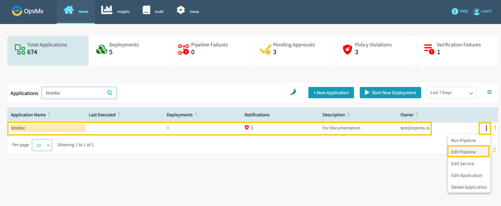
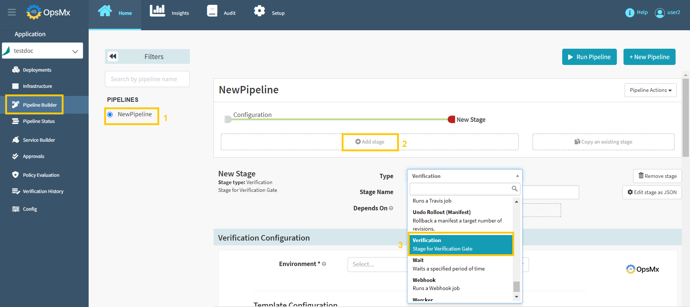
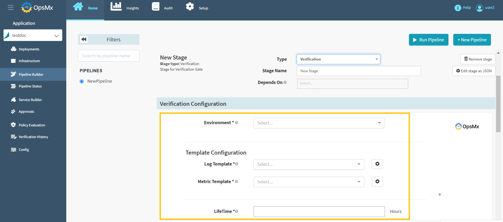
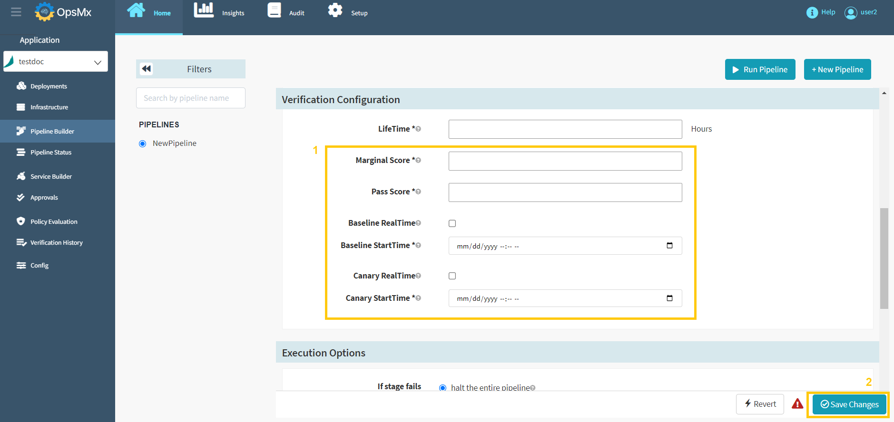

#**Add Verification Gate**#

A gate is an access point that allows you to stop the pipeline to automatically go to the next stage. 
A gate helps you to manually intervene and verify or approve a stage of the pipeline before moving on 
to the next stage in the sequence. Adding a Gate in ISD allows you to either automate your pipeline based 
on data from supported data sources. 

There are four types of gates you can add:

* Approval
 
* Verification
 
* Test Verification
 
* Policy

##**Verification Gate**##

An approval gate stops the pipeline and waits for approval either from a human user or from a computer based on data from a supported plugin.

You can add a **Verification** Gate after creating a pipeline to the application. To add a **Verification Gate** follow the steps below:

If you haven’t created an application already,  click [here](https://docs.opsmx.com/user-guide/manage-application/create-an-application).

If you haven’t created your pipelines yet, click [here](https://docs.opsmx.com/user-guide/manage-pipelines/create-a-pipeline).

1. From the Application dashboard, select your application name which you need to edit a pipeline. Click "**Three dots**" at end of the application name and then select "**Edit Pipeline**" as shown in the image below.

	

2. It will redirect you to the "**Pipeline Builder**" page, where you can modify your pipeline by selecting it from the left-hand side. Users can modify the available pipeline within the application as shown below.

	

3. Select your pipeline, where you need to add the Verification Stage. Click "**Add Stage**" and then select the type "**Verification**" from the drop-down menu as shown in the image below.

	

4. Next, you get the option to configure the verification gate as shown in the image below:

	

	

5.  Update the Verification configuration attributes as described below on the above screen.

	* **Verification configuration**

		* **Environment**: Select your environment from the drop-down menu
 
		* **Log Template**: Select or Add Log Template
 
		* **Metric Template**: Select or Add Metric Template 

		* **LifeTime**: Hours to let the analysis run before making a final determination

		* **Marginal Score**: If the score is equal to or higher than the Marginal but lower than the Pass Score, “Review” status is shown in the Analysis screen

		* **Pass Score**: If the Score equal to or higher than Pass Score, the stage will Pass

		* **Baseline Real Time**:

		* **Canary Real Time**:

6. Click "**Save changes**" and the Verification Gate is added to your pipeline.

