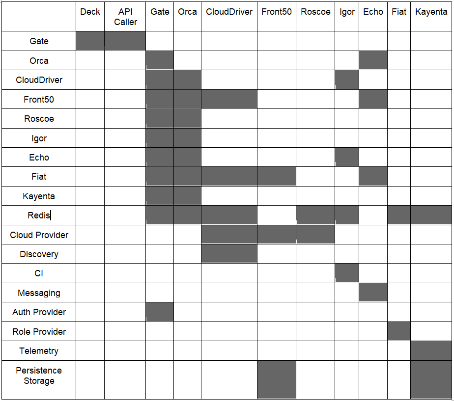

#**Application Dashboard**#
The application dashboard helps you to get a complete detailed view of the applications along with its services and pipelines. In the application dashboard you can also view the environments and the gates that the service or the application passes through before final deployment. You can also view the details of the deployment.

Click **"Dashboard"** and click **"Application Dashboard"**
##**Summary View**##
In the above dashboard, the first view is the summary view where you can see there are different applications with the following details:
 
 * Total Applications - The number of services in the application
 * Deployments - The deployment details
 * Pending Approvals - Any approvals which are pending
 * Policy Violations - Any policy violations
 * Verification Failures - Any failures in verification process

Total Applications - The number of services in the application

Total Applications - The number of services in the application

Total Applications - The number of services in the application

Total Applications - The number of services in the application

Total Applications - The number of services in the application

Total Applications - The number of services in the application

Total Applications - The number of services in the application

  <head>
    <title>Title of the document</title>
    
  </head>

| Cloud Driver |Deck          | API Caller     | Gate          | Orca         |
|:------------ |:------------:|:--------------:|:-------------:| ------------:|
| Gate         | Gate         | Roscoe         |               |              |
| Orca         | Front50      | Orca           |               |              |
| Cloud Driver | Roscoe       | Cloud Driver   |               |              |
| Front50      | Igor         | Front50        |               |              |
| Roscoe       | Orca         | Igor           |               |              |
| Igor         | Cloud Driver | Gate           |               |              |

