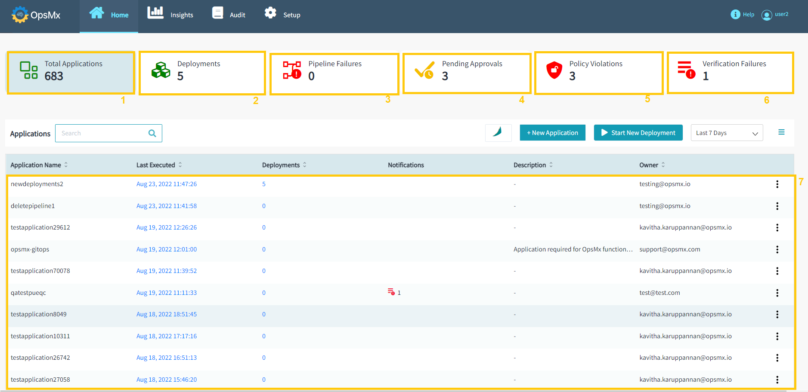
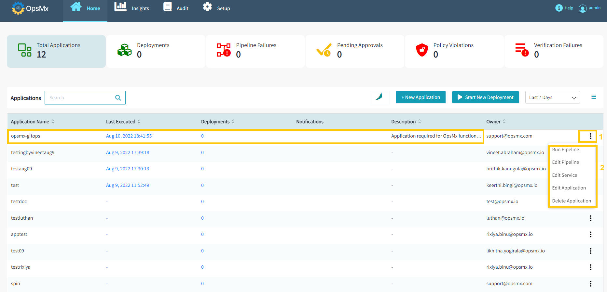
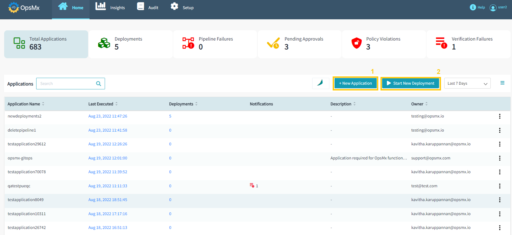
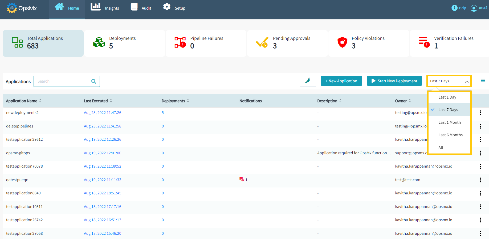
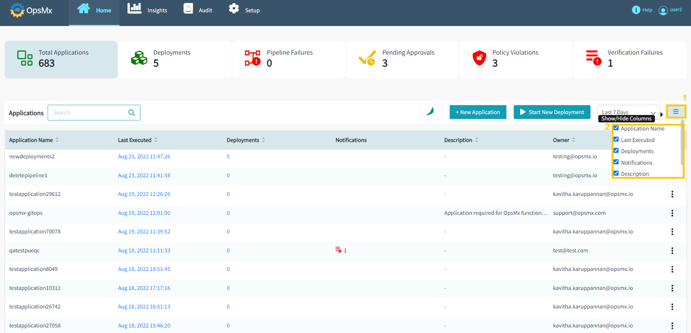

#**Application Dashboard**#

When you log into ISD, the first thing you will see is the Application dashboard. 
The application dashboard gives you the high-level operational information you need to help you 
understand the health of all your applications at a glance. In the application dashboard, you 
can also view the environments and the gates that the service or the application passes through 
before final deployment. 

* After your successful login, the Application Dashboard appears and it gives you high-level overviews of your applications, and pipelines along with the following important operational information: 

	1.** Total Applications** - The number of applications to which you have access.	

	2.** Deployments** - The total number of deployments, from all the applications to which you have access.	

	3.** Pipeline Failures** - Any pipeline failures, in any of the applications to which you have access.

	4.** Pending Approvals** - Any approvals which are pending for your action.

	5.** Policy Violations** - Any policy violations, in any of the applications to which you have access.
 
	6.** Verification Failures** - Any failures in the verification process within the applications to which you have access.

	7.** Applications** - Names of the each application

	

* Users can perform the following actions from the application dashboard:

	* [Edit Application](https://docs.opsmx.com/release-history/previous-releases/isd-4.0/user-guide/manage-application/configure-an-application)

	* [Edit Pipeline](https://docs.opsmx.com/release-history/previous-releases/isd-4.0/user-guide/manage-pipelines/edit-pipeline)

	* Edit Service

	* [Run Pipeline](https://docs.opsmx.com/products/orchestration-module-opsmx-enterprise-for-spinnaker-oes/additional-feature-configuration/pipeline-management/run-a-pipeline)

	* [Delete Application](https://docs.opsmx.com/release-history/previous-releases/isd-4.0/user-guide/manage-application/delete-an-application)

	From the Application dashboard, select your application name which you need to perform any of the following actions. Click "**Three dots**" at end of the application name and then select any of the actions as shown in the image below.

	

* Users will also have options to **[create a new application](https://docs.opsmx.com/release-history/previous-releases/isd-4.0/user-guide/manage-application/create-an-application)** and **[Deployment](https://docs.opsmx.com/quickstart-guide/manage-pipelines/run-deployments-execute-pipelines)** from the application dashboard.

	1.Click on "**+New Application**" button to create a new application.
 
	2.Click on "**Start New Deployment**" button to deploy your application. 

	

* Users can also change the time period to view the application within a certain duration. For example - 1 day, 7 days, 1 month, 6 months and all. To do so, click the **Last 7 days** drop-down and select the time period. Refer to the image below:

	

* User can opt to show or hide these columns in the list available. To do so, click the menu icon as shown in the image below. The list of available columns will appear. You can select/deselect a particular column to remove it from the application table.

	

