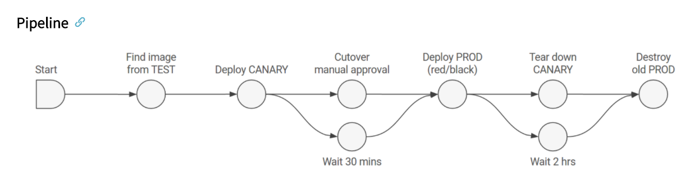
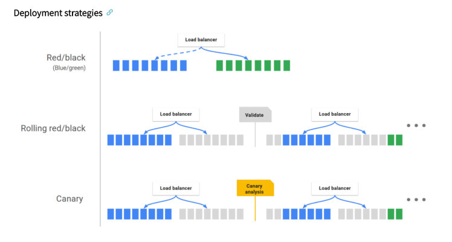

#**Application Deployment**#
Spinnaker's application deployment feature is responsible for the continuous delivery workflow.  
Some of the basic concepts of application deployment are:

* Pipeline
 
* Stage
 
* Deployment Strategies

Let’s discuss and learn how these concepts work.

##**Pipeline**##
The main deployment management constructor of Spinnaker is the pipeline. 
A pipeline defines a flow of actions in a particular sequence; for the code traversal, 
from commit all the way until it is deployed in the target deployment environment.

A pipeline comprises a series of actions known as stages. You can add/modify stages to a 
pipeline as you define it, allowing you to pass parameters from one stage to the next 
along the pipeline. The image below shows an example pipeline.

##**Stage**##
In Spinnaker, an automatically created building block for the pipeline is known as a stage. 
A stage in a pipeline is used to define a specific and finite activity. Herein, You can 
specify an action to be performed on a specific pipeline here. You can have as many stages 
as you wish in a pipeline based on what actions you want to perform; for example, a stage 
for code build, a stage for static code analysis, a stage for code deploy, etc.
 
Spinnaker can integrate with a large number of third third-party tools for 
performing the actions specified in a pipeline. For example, you can integrate Spinnaker 
with Jenkins, SonarQube, Terraform, Vault, test automation tools, etc.

##**Deployment Strategies**##
Spinnaker manages cloud-native deployment strategies as exclusive constructs, 
handling primary arrangements such as disabling old server groups, enabling new 
server groups, and verifying health checks. Spinnaker backs the red/black 
(also known as blue/green) strategy, with rolling red/black and canary 
strategies in active development. This enables the user to define the custom 
deployment strategy based on their organization requirements.

##**Spinnaker supports:**##

* Blue/green (AKA Red/Black)
 
* Rolling Red/black
 
* Highlander
 
* Dark Rollout

**Blue/Green (AKA Red/Black):** Blue/Green strategy, AKA Red/black strategy consists 
of creating new server groups and once the new server groups become healthy, removing 
the old server groups from the load balancer.

**Highlander:** The highlander strategy consists of creating new server groups and once 
the new server groups become healthy the old server groups are deleted.

**Dark rollout (None):** Dark roll outs involve doing nothing about the old server groups. 
Both old and new server groups stay on the load balancer.

Refer to the figure below for a better understanding:

 

