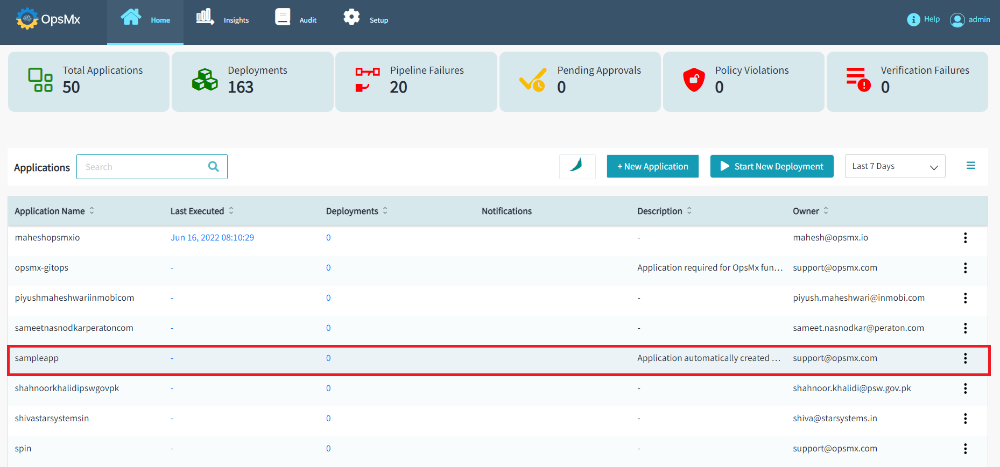
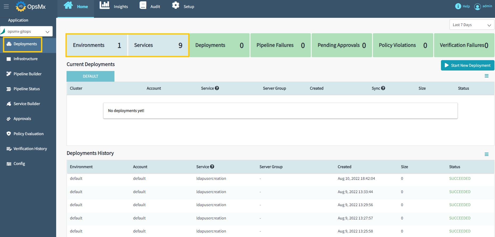
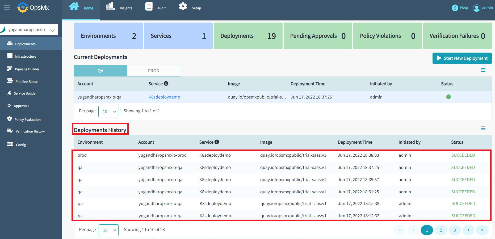
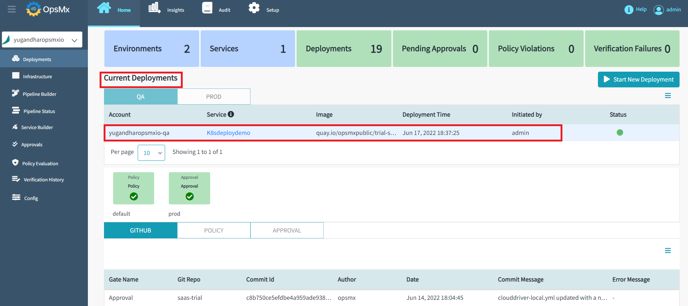
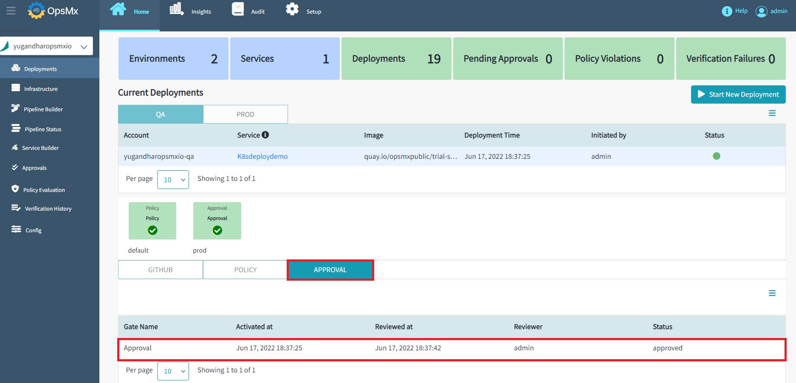
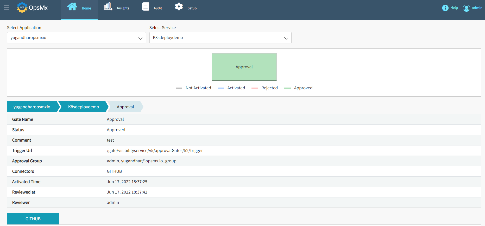

#**Application Service View**#

A service can have one or more pipelines deploying it to different environments. When a pipeline contains a deploy stage, that is when we can assume that it is deploying the service to some environment.

One pipeline can have multiple deploy stages deploying the service to multiple environments or the service can utilize multiple pipelines to do the same thing. This is where the Application service view helps you to view all the deployment details including the following:

* Details of the environments in which the services are deployed.

* Number of deployments for the application.

* Details of the Current deployment and deployment history.

* Detailed view of the different connectors and gates in sequence.

* Status of the deployment as success and failure.

* OES-Customconnector details are shown if the integrator is added in Spinnaker for synced Spinnaker applications.

* Details of evaluated policies to reach the deployment.

To view the Deployment details, click on any of the applications from the dashboard and it will redirect you to "**Pipeline Status**" page. 

Click on the "**Deployments**" and the deployment details screen will appear as shown below:

The above screen shown the following details:

* The number of environments of that application. In this example 1 we have.

* The number of services of the application. In this example 9 we have.

* The number of deployments with details in the Deployment History table. In this example 19.

Now to view the details of the current deployment click on the row for which you want to view. The details will appear as shown below:

In the above screen, you can also view the details of the different connectors and gates. In this example - The pipeline has 1 connector GITHUB and 2 gates as POLICY and APPROVAL.

You can also click the row of the connector to view the details. For example - If you click the row of GIT it will take you to the GitHub repository.

Similarly, if you want to view the details of the gates, click on the row of the gate. For example, if you want to view the details of the approval gate click the row as shown below:

It will take you to the approval gate details as shown below:

