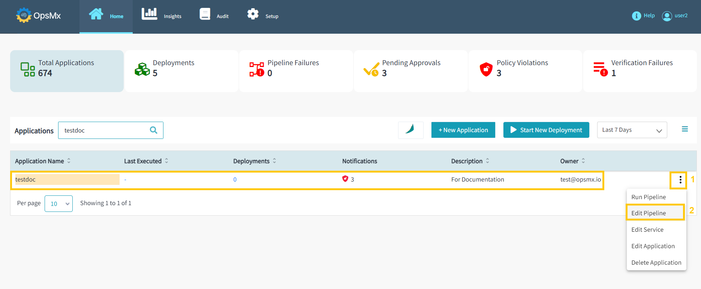
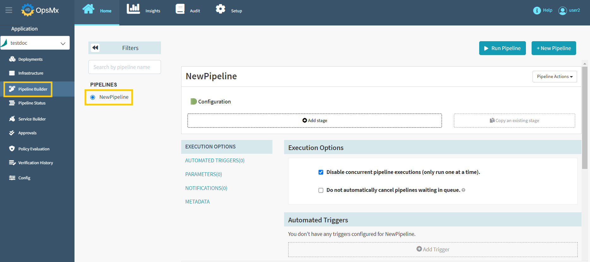
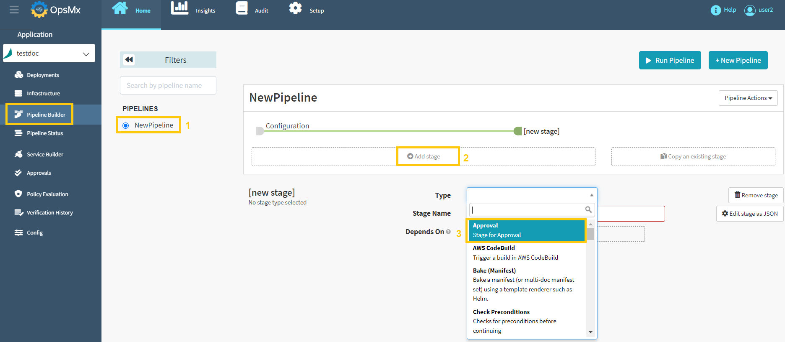
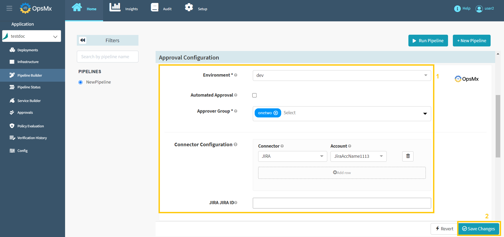

#**Approval Gate**#

A gate is an access point that allows you to stop the pipeline to automatically go to the next stage. A gate helps you to manually intervene and verify or approve a stage of the pipeline before moving on to the next stage in the sequence. Adding a Gate in ISD allows you to either automate your pipeline based on data from supported data sources.

There are four types of gates you can add:

* Approval
 
* Verification
 
* Test Verification
 
* Policy

##**Approval Gate**##

An approval gate stops the pipeline and waits for approval either from a human user or from a computer based on data from a supported plugin.

You can add an Approval Gate after creating a pipeline to the application. To add an **Approval Gate** follow the steps below:

If you haven’t created an application already,  click [here](https://docs.opsmx.com/release-history/previous-releases/isd-4.0/user-guide/manage-application/create-an-application).

If you haven’t created your pipelines yet, click [here](https://docs.opsmx.com/release-history/previous-releases/isd-4.0/user-guide/manage-pipelines/create-a-pipeline).

1. From the Application dashboard, select your application name which you need to edit a pipeline. Click "**Three dots**" at end of the application name and then select "**Edit Pipeline**" as shown in the image below.

	

2. It will redirect you to the "**Pipeline Builder**" page, where you can modify your pipeline by selecting it from the left-hand side. Users can modify the available pipeline within the application as shown below.

	

3. Select your pipeline, where you need to add the Approval Stage. Click "**Add Stage**" and then select the type "**Approval**" from the drop-down menu as shown in the image below. 

	

4. Select the gate type as "**Approval**", you can do the following:

	* Select the **Connector** from the drop-down. The available connectors are:

		* JIRA
 
		* GITHUB

		* VERIFICATION

		* SONARQUBE
 
		* JENKINS
 
		* AQUAWAVE
 
		* APPSCAN

		* BAMBOO

		* BITBUCKET

		* BITBUCKET SERVER

		* PRISMA CLOUD

		* ARTIFACTORY

		* JFROG

		* SERVICENOW

	* Update the configuration details and select the **Account** from the drop-down and then click "**Save Changes**" as shown in the below image. 

	

