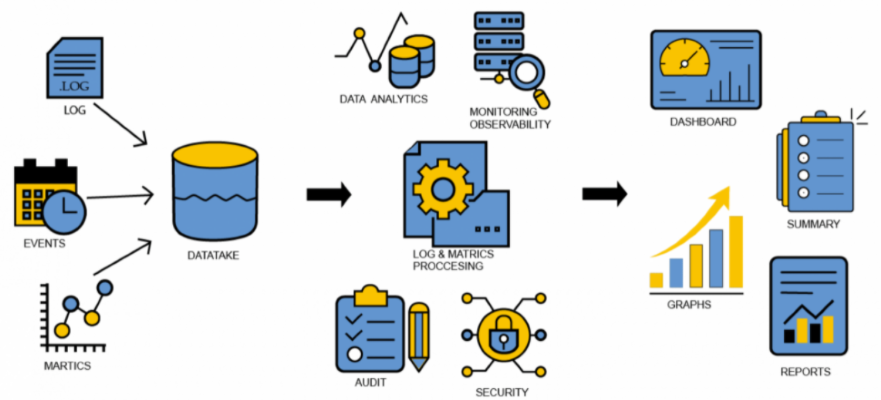

#**Audit and Traceability**#
As software release velocity increases, so does the challenge of keeping track of the various 
deployments and events in the overall software delivery. Also, security and compliance events 
require an audit of the CD events but also traceability of the artifacts and data that led to 
the promotion of releases to the production. OpsMx ISD keeps a 100% audit of all CD events allowing 
one to understand who deployed, what, and when, and who approved the release, and what data was used 
to approve the release.

As software release velocity increases, the challenge of keeping track of the various deployments 
and events in the overall software delivery increases. Autopilot helps auditors find various CD 
events and trace information about artifacts that led to the promotion of releases to the production. 
Autopilot keeps a 100% record of all delivery events such as who deployed, which software is deployed 
when deployed, any policy violations, who approved a release, what data was used to approve the 
release, etc.

###**Overview:**###
Autopilot gathers data from various CI/CD tools, APM, and log analyzers and applies supervised and 
unsupervised machine learning to find out software risks.

 

