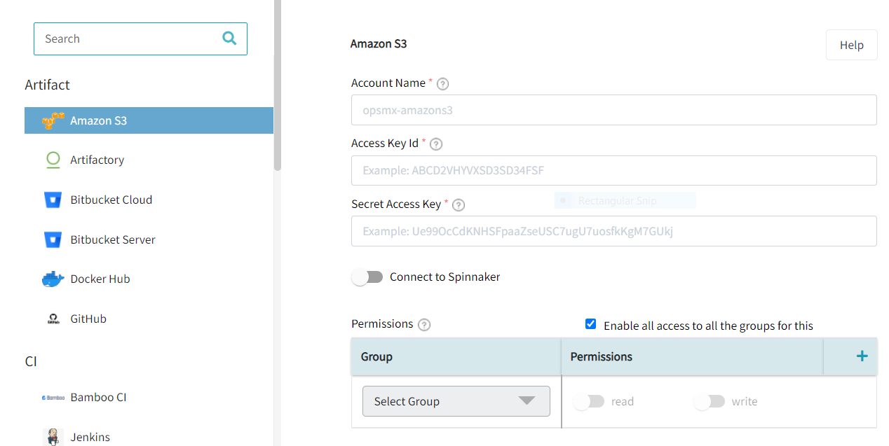

#**Available Integrations**#

##**Artifact**##

###**Amazon S3**###

The following figure depicts the information to be supplied to add Amazon S3 as an integration.

Following are the fields:

* *Account Name: Name of the Amazon account to operate on*

* *Access Key ID: Your AWS Access Key ID. If not provided, Halyard/Spinnaker will try to find AWS credentials as described at [http://docs.aws.amazon.com/sdk-for-java/v1/developer-guide/credentials.html#credentials-default](http://docs.aws.amazon.com/sdk-for-java/v1/developer-guide/credentials.html#credentials-default)*

* *Secret Access Key: Your AWS Secret Key*

* *Connect to Spinnaker: Enable the selection & Select the spinnaker instance you want to associate this account to*

* *Group and permission: Enable all access to all the groups for this.*

!!! Note
	To select a group, click on the drop-down arrow under select group.

###**Artifactory**###

The following figure depicts the information to be supplied to add Artifactory as an integration.

Following are the fields:

* *Account Name: Name of the Artifactory account to operate on*

* *Host URL: The base url your Artifactory search is reachable at*

* *Repo: The repo in your Artifactory to be searched*

* *Repo Type: The package type of repo in your Artifactory to be searched*

* *Group ID: The group id in your Artifactory to be searched*

* *Authentication Type: Select the user authentication mode for Artifactory*

* *User Name: Provide Artifactory user name*

* *Token / Password: Provide Artifactory token or password, based on the authentication type selected*

* *Connect to Spinnaker: Enable the selection & Select the spinnaker instance you want to associate this account to*

* *Read Permissions: A user must have at least one of these roles in order to view this build search or use it as a trigger source*

* *Write Permissions: A user must have at least one of these roles in order to be able to run jobs on this build search*

* *Group and Permission: Enable all access to all the groups for this.*

###**Bitbucket Cloud**###

The following figure depicts the information to be supplied to add Bitbucket Cloud as an integration.

Following are the fields:

* *Account Name: Name of the Bitbucket account to operate on*

* *Host URL: The base url your Bitbucket search is reachable at*

* *API URL: Your organizations unique API url*

* *Authentication Type: Select the user authentication mode for Bitbucket*

* *User Name: Provide Bitbucket user name*

* *Token / Password: Provide Bitbucket token or password depending on the authentication type selected*

* *Connect to Spinnaker: Enable the selection & Select the spinnaker instance you want to associate this account to*

* *Group and Permission: Enable all access to all the groups for this.*

###**Bitbucket Server **###

The following figure depicts the information to be supplied to add Bitbucket Server as an integration.

Following are the fields:

* *Account Name: Name of the Bitbucket account to operate on*

* *Host URL: The base url your Bitbucket search is reachable at*

* *Authentication Type: Select the user authentication mode for Bitbucket*

* *User Name: Provide Bitbucket user name*

* *Token / Password: Provide Bitbucket token or password depending on the authentication type selected*

* *Connect to Spinnaker: Enable the selection & Select the spinnaker instance you want to associate this account to*

* *Group and Permission: Enable all access to all the groups for this.*

###**Docker Registry**###
 
The following figure depicts the information to be supplied to add Docker Registry as an integration.

Following are the fields:

* *Account Name: Name of the Bitbucket account to operate on*

* *Registry URL: Your Docker Registry url* 

* *Email: Provide the email ID of the Atlassian user*

* *Repo: The repo in your Artifactory to be searched*

* *Authentication Type: Select the user authentication mode for Docker Registry*

* *Connect to Spinnaker: Enable the selection & Select the spinnaker instance you want to associate this account to*

* *Group and Permission: Enable all access to all the groups for this.*

##**CI**##

###**Jenkins**###

The following figure depicts the information to be supplied to add Jenkins as an integration.

Following are the fields:

* *Account Name: Name of the Jenkins account to operate on*

* *Host URL: Host URL for the Jenkins instance you are connecting to*

* *Authentication Type: Select the type of authentication mechanism you want to use to get authenticated to Jenkins server*

* *User Name: Provide the username on the Jenkins server*

* *Token / Password: Provide the token or password, depending on the authentication type selected*

* *Connect to Spinnaker: Enable the selection & Select the spinnaker instance you want to associate this account to*

* *Read Permissions:*
 
* *Write Permissions:* 

##**Governance**##

###**JIRA**###

The following figure depicts the information to be supplied to add JIRA as an integration.

Following are the fields:

* **Account Name**: Name of the JIRA account to operate on

* **Email**: Provide the email ID of the Atlassian user

* **Token**: Provide the password of the Atlassian user

* **Host URL**: Provide Atlassian Host URL (for both Cloud or On-prem Atlassian)

* **Connect to CD**: Enable the selection & Select the spinnaker instance you want to associate this account to

* **Permissions**: To restrict permissions to this account, you can select the **User Groups** from the dropdown and the required checkboxes. Once the permissions are configured for a User Group, the access will be restricted to all other User Groups except for Administrators. 
By default, all users have access to this account.

* **Save**: To finish configuring the JIRA, click on "**Save**". OpsMx ISD verifies the settings you entered. The JIRA integrator is now added to OpsMx ISD.

###**ServiceNow**###

The following figure depicts the information to be supplied to add ServiceNow as an integration.

Following are the fields:

* **Account Name**: Name of the JIRA account to operate on

* **Host URL**: Provide Atlassian Host URL (for both Cloud or On-prem Atlassian)

* **User Name**: Provide the username of the ServiceNow user

* **Password**: Provide the password of the ServiceNow user

* **Connect to CD**: Enable the selection & Select the spinnaker instance you want to associate this account to

* **Permissions**: To restrict permissions to this account, you can select the User Groups from the dropdown and the required checkboxes. Once the permissions are configured for a User Group, the access will be restricted to all other User Groups except for Administrators. 
By default, all users have access to this account.

* **Save**: To finish configuring the JIRA, click on "**Save**". OpsMx ISD verifies the settings you entered. The **ServiceNow** integrator is now added to OpsMx ISD.

##**Monitoring Tools**##

###**AWS Cloudwatch**###

The following figure depicts the information to be supplied to add AWS CloudWatch as an integration.

Following are the fields:

* *Account Name: Name of the AWS Cloudwatch account to operate on*

* *Access Key ID: The default access key used to communicate with AWS Cloudwatch*

* *Secret Access Key: The default secret key used to communicate with AWS Cloudwatch*

###**AppDynamics**###

To set up AppDynamics to work with the OpsMx ISD Verification gate feature, AppDynamics should be added as the monitoring provider.

Follow the below steps to add AppDynamics as an integration.

* **Add Monitoring Provider** : Add AppDynamics as an integration. To add an integration, [**refer here**](https://docs.opsmx.com/additional-resources/previous-releases/isd-3.12/opsmx-intelligent-software-delivery-platform/system-setup/data-sources). Search "**AppDynamics**" and select AppDynamics under Monitoring Tools.

* Fill in the following information on the above screen.

	1 . **Account Name**: Enter a name for the AppDynamics connection. This is the name you will select when you choose a Datasource provider during metrics configuration.
 
	2 . **Controller Host**: Enter the URL for your AppDynamics account for API access. For example, enter the full URL of your AppDynamics controller, such as https://opsmx-nfr.saas.appdynamics.com/ 
	
	3 . **Temporary Access Token**: You can generate and use the access token for API access calls into your Controller by generating the token through Administration UI. 
		The account administrator can generate and distribute to parties/teams who need controller access. To generate the token, [**refer here**](https://docs.appdynamics.com/appd/21.x/21.3/en/extend-appdynamics/appdynamics-apis/api-clients#APIClients-GeneratetheTokenThroughtheUI). 
	
	4 . **Permissions**: To restrict permissions to this account, you can select the **User Groups** from the dropdown and the required checkboxes. Once the permissions are configured for a User Group, the access will be restricted to all other User Groups except for Administrators. 
		By default, all users have access to this account.
	
	5 . **Save**: To finish configuring the AppDynamics provider, click on "**Save**". OpsMx ISD verifies the settings you entered. The AppDynamics provider is now added to OpsMx ISD.

To use AppDynamics Provider for verification, [**refer here**](https://docs.opsmx.com/additional-resources/previous-releases/isd-3.12/data-and-intelligence-module-autopilot/autopilot/appdynamics-verification#using-appdynamics-provider-for-verification).

###**Datadog**###

The following figure depicts the information to be supplied to add DataDog as an integration.

Following are the fields:

* *Account Name: Name of the Datadog account to operate on*

* *API Key: Your organizations unique Datadog API key. See [https://app.datadoghq.com/account/settings#api](https://app.datadoghq.com/account/settings#api)*

* *Application Key: Your Datadog application key. See [https://app.datadoghq.com/account/settings#api](https://app.datadoghq.com/account/settings#api)*

###**ElasticSearch**###

The following figure depicts the information to be supplied to add ElasticSearch as an integration.

Following are the fields:

* *Account Name: Name of the Elastic account to operate on*

* *Elastic End Point: End of the Elasticsearch URL for the account to operate on*

* *User Name: Provider the user name for the ElasticSearch instance*

* *Password: Provider the password for the ElasticSearch instance*

* *Kibana End Point: Endpoint URL for the Kibana instance*

* *Kibana User Name: Provide the username for the Kibana instance*

* *Kibana Password: Provide the password for the Kibana instance*

###**Graphite**###

The following figure depicts the information to be supplied to add Graphite as an integration.

Following are the fields:

* *Account Name: Name of the Graphite account to operate on*

* *End Point: URL of the endpoint of Graphite*

###**Graylog**###

###**NewRelic**###

The following figure depicts the information to be supplied to add New Relic as an integration.

Following are the fields:

* *Account Name: Name of the New Relic account to operate on*

* *API Key: Your account’s unique New Relic Insights API key. See [https://docs.newrelic.com/docs/insights/insights-api/get-data/query-insights-event-data-api](https://docs.newrelic.com/docs/insights/insights-api/get-data/query-insights-event-data-api).*

* *Application Key: Your New Relic account id. See [https://docs.newrelic.com/docs/accounts/install-new-relic/account-setup/account-id](https://docs.newrelic.com/docs/accounts/install-new-relic/account-setup/account-id).*

###**Prometheus**###

The following figure depicts the information to be supplied to add Prometheus as an integration.

Following are the fields:

* *Account Name: Name of the Prometheus account to operate on*

* *End Point: The base URL to the Prometheus server*

* *User Name: Provide Prometheus User Name*

* *Password: Provide Prometheus Password*

###**Splunk**###

The following figure depicts the information to be supplied to add Splunk as an integration.

Following are the fields:

* *Account Name: Name of the Splunk account to operate on*

* *Splunk URL: The base URL to the Splunk server*

* *User Name: Provide Splunk user name*

* *Password: Provide Splunk password*

* *Splunk Dashboard URL: Provide URL of the Splunk dashboard*

###**Stackdriver**###

The following figure depicts the information to be supplied to add Stackdriver as an integration.

Following are the fields:

* *Account Name: Name of the Stackdriver account to operate on*

* *Encrypted Key File: A path to a Google JSON service account that has permission to publish metrics.*

###**SumoLogic**###

The following figure depicts the information to be supplied to add SumoLogic as an integration.

Following are the fields:

* *Account Name: Name of the Sumologic account to operate on*

* *Access ID:*

* *Access Key:*

* *Zone:*

###**VMWare Tanzu Observability**###

We have extended the list of supported monitoring tools by adding support to Tanzu Observability from VMware. 
Now you can use ISD to perform continuous verification on Metrics from Tanzu Observability to get real-time 
insights and mitigate risks during continuous delivery.

The below figure depicts the information to be provided to add "**VMWare Tanzu Observability**" as an integration.

Following are the fields:

* *Account Name: Name of the VMWare Tanzu Observability account to operate on*

* *End Point: Provide the URL of the VMWare Tanzu Observability server*

* *API Token: Provide the API token for VMWare Tanzu Observability*

##**Notifications**##

###**Slack**###

The following figure depicts the information to be supplied to add Slack as an integration.

Following are the fields:

* *Account Name: Name of the Slack account to operate on*

* *Bot Name: Provide the name of your slack bot*

* *Token: Provide the slack bot token*

* *Connect to Spinnaker: Enable the selection & Select the spinnaker instance you want to associate this account to*

##**Policy**##

###**OPA (Open Policy Agent)**###

The following figure depicts the information to be supplied to add OPA (Open Policy Agent) as an integration.

Following are the fields:

* *Account Name: Name of the OPA account to operate on*

* *End Point: Provide the URL of the OPA server*

##**SAST/DAST**##

###**AquaWave**###

The following figure depicts the information to be supplied to add AquaWave as an integration.

Following are the fields:

* *Account Name: Name of the Aquawave account to operate on*

* *User Name: Provide the username for Aqua wave*

* *Bearer Token: Provide the bearer token for Aqua wave*

###**HCL AppScan**###

The following figure depicts the information to be supplied to add HCL AppScan as an integration.

Following are the fields:

* *Account Name: Name of the HCL Appscan account to operate on*

* *Bearer Token: Provide the bearer token for HCL Appscan*

###**SonarQube**###

The following figure depicts the information to be supplied to add SonarQube as an integration.

Following are the fields:

* *Account Name: Name of the Sonarqube account to operate on*

* *Host URL: Provide the host URL of the SonarQube Server*

* *Token: Provide the token to access the SonarQube server*

##**Verification**##

###**Autopilot**###

The following figure depicts the information to be supplied to add Autopilot as an integration.

Following are the fields:

* *Account Name: Name of the account to operate on*

* *User Name: Provide the user name with which you would access the OES verification services*

