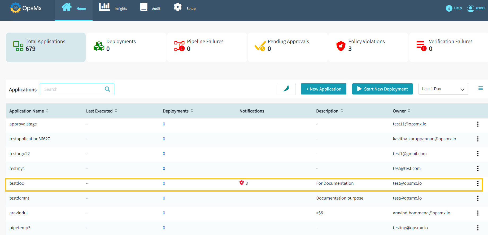

#**Blue/Green deployment using Manifest**#
Blue/green strategy is a deployment strategy that is designed to minimize risk by gradually copying the contents of the old server group onto the new before disabling the old server group. 

Using a Blue/Green (AKA a red/black) Deployment strategy is easy, as Spinnaker natively supports a Blue/green strategy.

To use a Blue green Strategy,

1. **Go to Application Dashboard**: When you log in to ISD you would start at the application dashboard. 
Users will see a list of applications or [create a new application](https://docs.opsmx.com/user-guide/manage-application/create-an-application) entirely. 
**Click on the application** where you want to build this pipeline. For the purposes of this tutorial, we are using the application **“testdoc”**.

	

2. **Pipeline Builder**: Once you click on an application, it will redirect you to the "Pipeline Status" page. 
Click "**Pipeline Builder**" navigate to the pipelines screen and then click "**+New Pipeline**" button 
to [create a new pipeline](https://docs.opsmx.com/user-guide/manage-pipelines/create-a-pipeline) as shown in the image below. 
Users can also view the existing pipelines on the left side of the screen.

	

3. **Click on “add stage”:** The add stage button is just under the diagrammatic representation of your pipeline. When you click this button, you can select many different types of stages that ISD supports.

	

4. **Select “Deployment”:** You can add a host of different stages using a drop down menu. They are all alphabetically sorted. Scroll down and select “**Deploy(Manifest)**”.

	

5. **Select your account:** An account is the name given to a kubernetes cluster.

	

6. **Select your namespace:** A namespace is a specific address within a Kubernetes cluster, select the checkbox that says override namespace and you will be able to 
select the namespace in which your manifest will deploy.

	

7. **Add your manifest object:** You can add your manifest as a [text](https://docs.opsmx.com/user-guide/manage-pipelines/execute-pipelines-run-deployments/deployment-to-kubernetes-namespace-with-manifest-file) or 
as an [artifact](https://docs.opsmx.com/user-guide/manage-pipelines/execute-pipelines-run-deployments/deployment-to-kubernetes-namespace-with-git-based-manifest).
 
	

8. **Select rollout strategy options:** Click on the statement ‘spinnaker manages your traffic based on your selected strategy’. Define the **service namespace** and **service** you are applying this strategy to in below screen.

	

9. Select your strategy from the drop-down list, you will find the **Red/black strategy**.

	

10. **Add additional configurations:** Finalize your configurations.