#**Configure an Application**#

Follow the steps below to begin configuring the application you created: 

1. From the Application dashboard, select your application name which you need to edit Click "**Three dots**" at end of the application name and then select "**Edit Application**" as shown in the image below.

	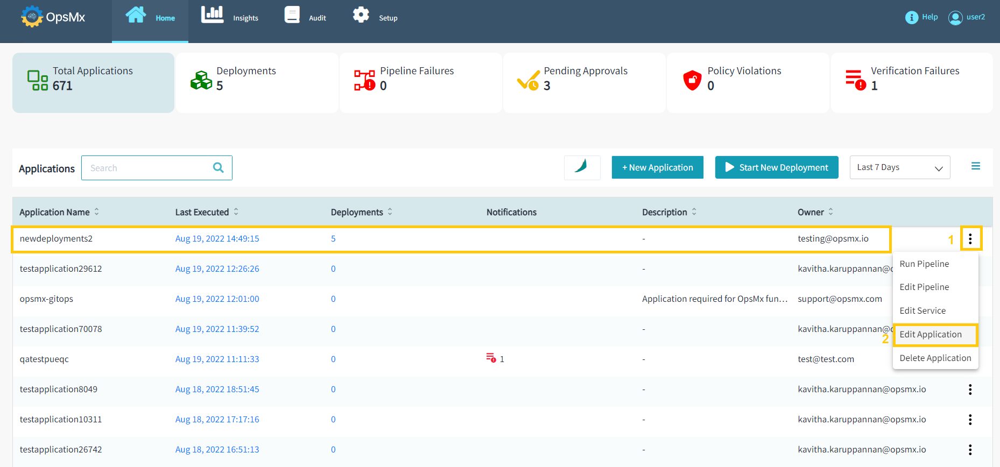

2. This will take you to the **Config page**, where you can modify the application's various attributes. Click on the "**Edit Application Attributes**" to edit the application attributes.

	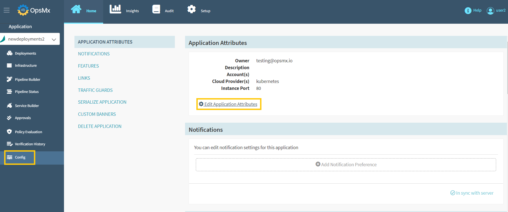

3. The application attributes that you specified during the creation process will be displayed as shown below. You can make the necessary changes and click "**Update**".

	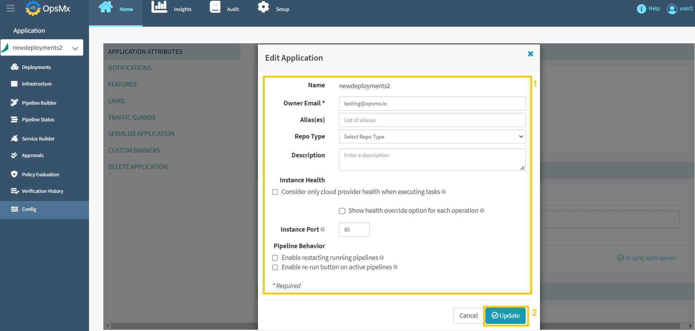

	Editing an application allows you to add various features to Spinnaker like

	* Configuring Notifications
 
	* Enable or disable certain features
 
	* Create a traffic guard
 
	* Delete the application entirely.

##**Create Pipeline Notifications**##
 
You can send notifications after the pipeline activities are completed. Follow the steps outlined below to do so:

1. From the Config page, Click "**Notifications**" and then click "**Add Notification Preference**" to create pipeline notifications.

	

2. **Edit Notification** pop-up window will appear, allowing you to update the necessary columns as described in the following steps.

	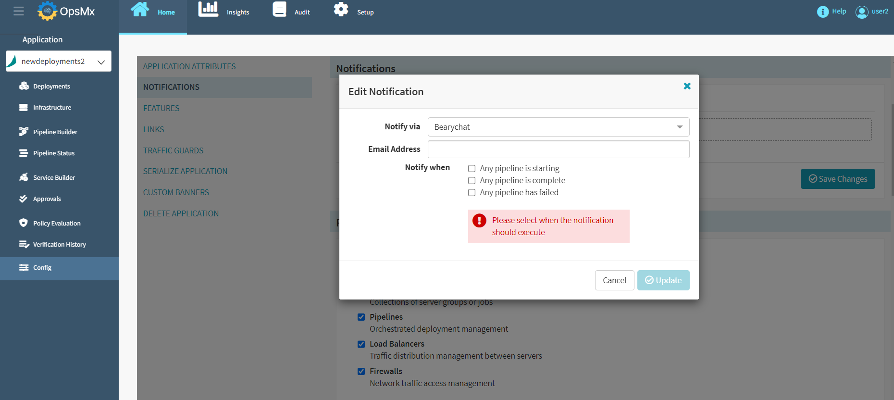

	Follow the sequence as shown in the image below for steps 3 to 6.

	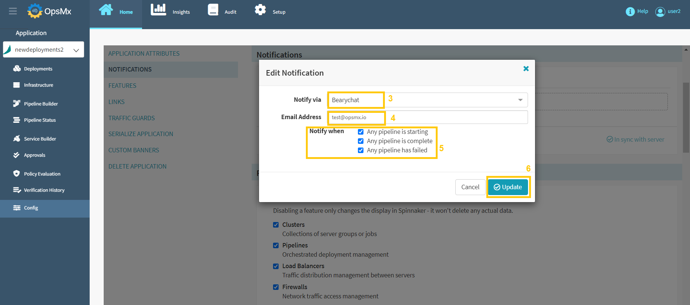

3. Select a notification method from the "**Notify via**" drop-down box and the options are 

	* Bearychat
 
	* Email
 
	* GoogleChat
 
	* Pubsub 

	* Slack

4. Provide the following information based on the selected notification type: 

	* Email address
 
	* Chat/Team webhook URL
 
	* Publisher name

5. Select the pipeline event that will trigger this notification:

	* When a pipeline started
 
	* When a pipeline finished
 
	* When a pipeline failed

6. Click **Update** and the newly added Pipeline Notifications appear as shown below:

	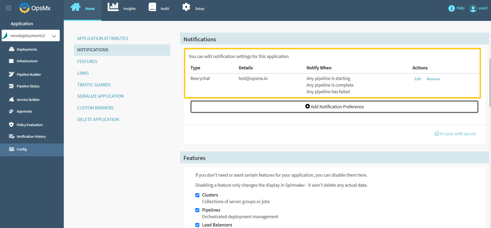

7. Users can edit or remove the pipeline notifications by clicking the "**Edit/Remove**" options.

	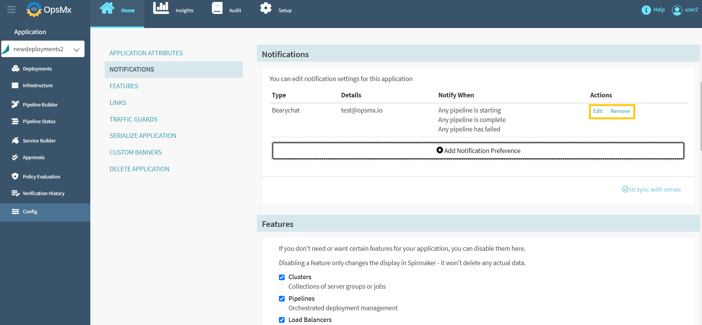

##**Enable or Disable Application Features**##

Users can disable any of the application's main features if they don't need them. Existing data will not be deleted if they are disabled. 

1. Click "**Features**" and "**check/uncheck**" the checkbox to enable/disable any of the features as shown in the below image:

	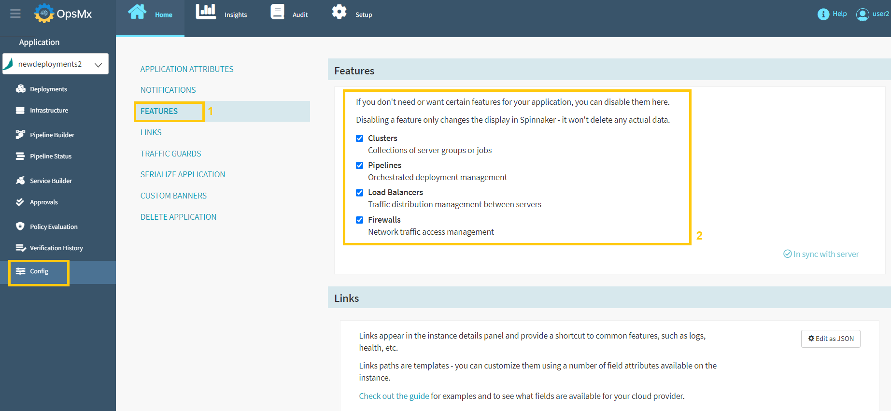

##**Add Custom Instance Links**##

Custom links can also be added to the instance details panel. This will help you to provide shortcuts to information about the instance, such as health, logs, etc. Note: Custom instance links are currently not supported for Kubernetes resources.. If the public IP address of the instance is available, it is used to resolve these links. Otherwise, a private IP is used. The default port is 80 and to change the port follow the instructions below:

1. Click "**Links**" and click the "**Add Section**" button to add custom instance links.

	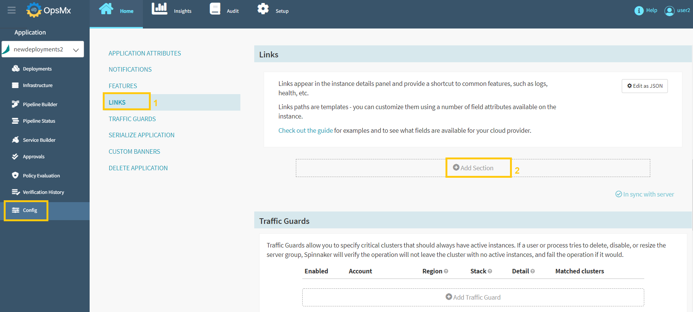

2. Below screen will appear after you click the **Add Section** button.

	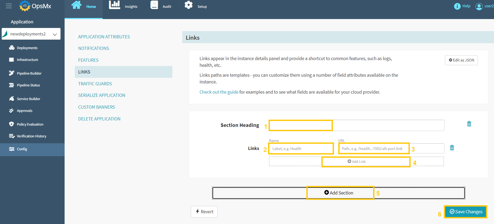

	Update the details in the above screen as described below.

	* Enter text for the new **Section heading** in the text box.

	* In the **Links** text box, enter the text that you want to display

	* In the **URL** text box , enter the path to the link target. References to these specific instance attributes can also be added. Wrap them in curly braces to accomplish this. For example, use {region}.

	* Click **Add Link** to add additional links that you want to display.

	* Click **Add Section** to add any additional sections.

	* Click **Save Changes** when you’re finished.

##**Designate a Traffic Guard Cluster**##

You can also create a traffic guard cluster and designate it to have at least one active instance. When enabled, this traffic guard cluster allows Spinnaker to verify if a user or process is trying to disable, resize, or delete the server group.

1. Click "**Traffic Guards**" and click "**Add Traffic Guard**" button to designate a traffic guard cluster as shown in the below image:

	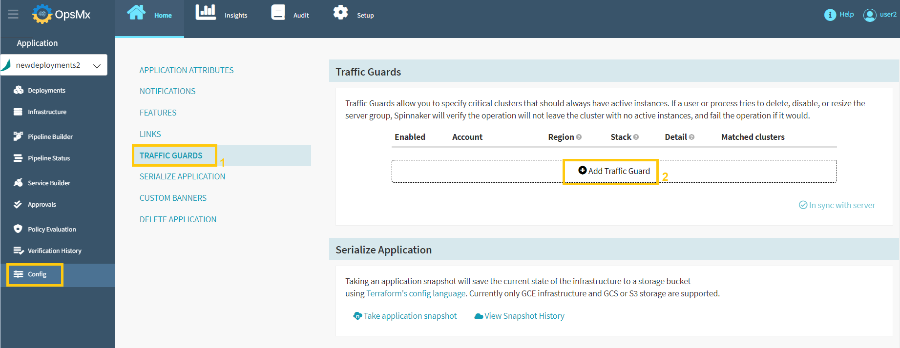

2. When you click on **Add Traffic Guard**, the following options will appear:

	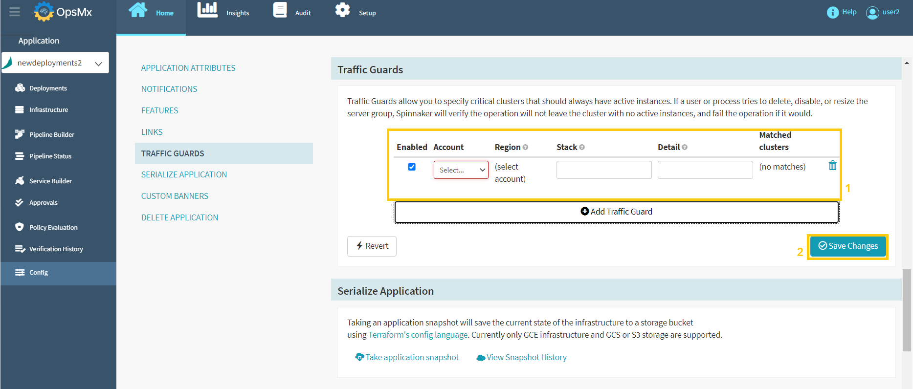

3. Update the above **Traffic Guards** section with the details as described below, then click "**Save Changes**".

	* **Account** - The account for which you’re setting up the traffic guard

	* **Region** - The applicable region from the list, or select the wildcard (*) to include all stacks

	* **Stack** - The stack to which to apply this traffic guard. Leave blank to apply the guard only to a cluster that has no stack. You can use the wildcard (*) to include all stacks (including no stack).

	* **Detail** - The detail string necessary to identify this cluster via the application stack-detail naming convention.

