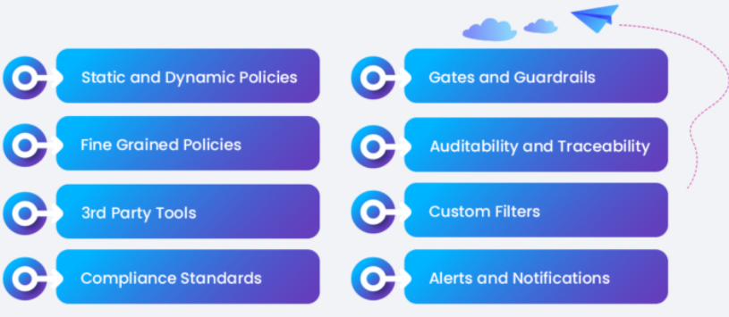
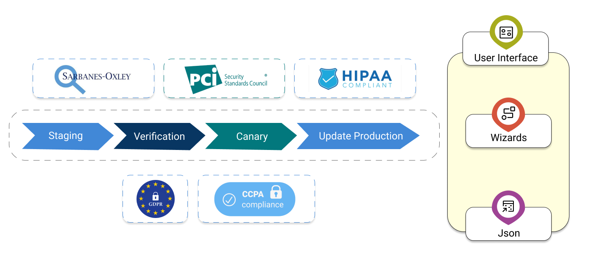

#**Continuous Compliance - Policy**#
Typical enterprises need to validate various policies during software releases.  Some of the policies 
are team, corporate, security policies, while others are industry regulations like SOX, HIPPA, 
FedRamp, etc.  OpsMx ISD integrates with 40+ eco-system tools (e.g., source code repository, CI, 
SAST/DAST, CD, and Monitoring tools)  and ingests relevant data about the new release available for 
use by the policy engine.  The policy engine allows the creation of extensible policies that can act 
on data ingested from various data sources. This capability allows OpsMx ISD to fully automate the 
policy check and allow for automated approval of releases.

This feature lets you ensure compliance to industry standards and organizational policies while 
shipping your releases faster to production. Quickly identify the who, what, when, where, and 
how for your pipelines and applications through audit reports and traces.

It caters to the rigid world of regulatory compliance with static compliance as code – while having the 
freedom and flexibility to tie policy and control into the rapidly changing IT services. It lets you 
create accurate coverage with controls by specifying them at an abstract level – while enforcing them 
at a pipeline level by integrating with Spinnaker.

 

