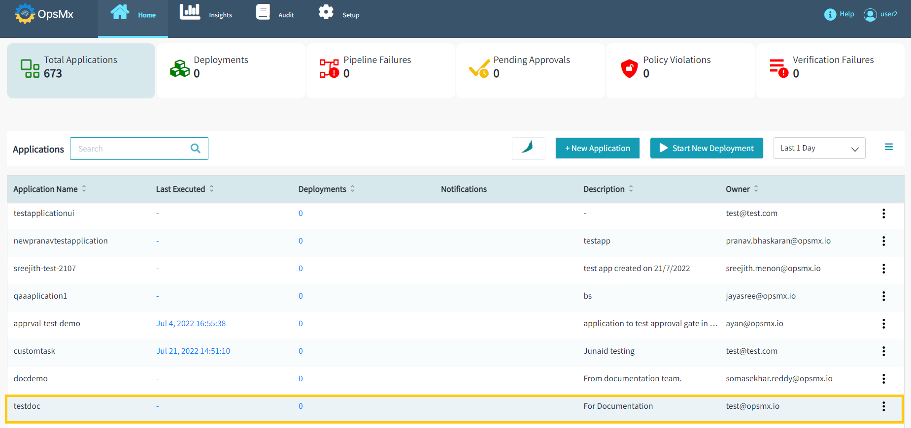
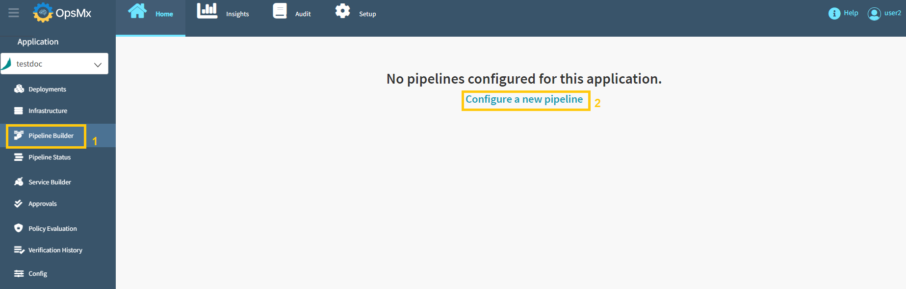
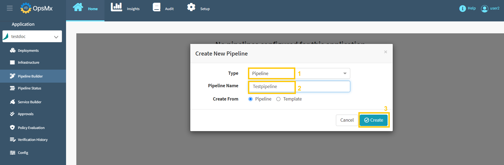
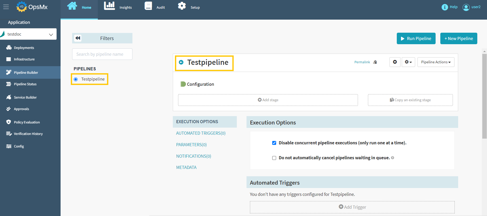

#**Create a Pipeline**#

A pipeline is a series of sequential steps that are performed as part of a ISD application. ISD has a host of pre-built stages which you can use to perform fairly complex tasks.

##**Create Pipeline**##

While we do have guides to run specific tasks, here we are going to create a basic pipeline with a “Wait” stage. To do this, follow the steps below:

1. From the ISD application dashboard, click the application for which you want to create a pipeline. It will redirect you to the pipeline builder page.

	

2. Click “**Configure a new pipeline**”. This demo application is not configured with any pipelines. If any pipelines are configured, those pipelines will be displayed here.

	

3. Select the “**Pipeline**” type from the drop-down and enter the "**Pipeline Name**" and then click "**Create**" as shown below.

	

4. Newly created pipeline displayed here as shown below. Here you can see the pipelines you have within the application which allow you to either build a new pipeline or configure an existing one. You also can run the selected pipeline here.

	

A new pipeline has been created successfully. After that, you need to **add a stage** to the pipeline.

