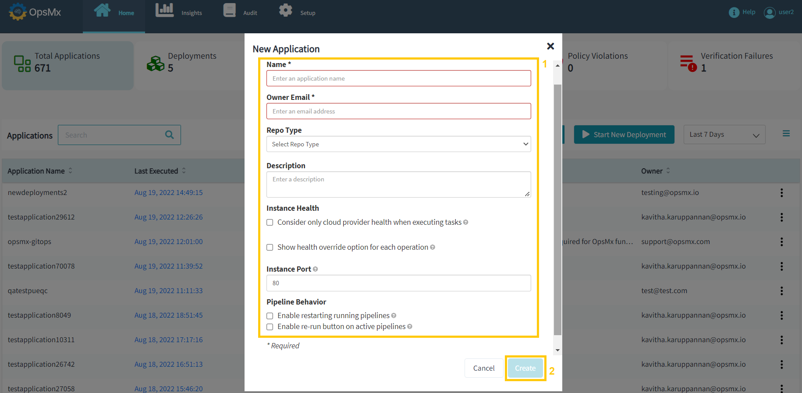

#**Create an Application**#

The following procedure creates a new Application. Once you are done, you can add components to the Application like pipelines and then deploy it.

1. From the Application dashboard Click "**Create Application**" button and the pop-up window will appear.

	

2. A new pop-up window will appear to provide attributes as shown in the below image.

	

3. Enter the application attributes as described below on the above screen, then click **Create**. 

	* **Name** - A unique name to identify this application
 
	* **Owner Email** - The email address of the owner of this application
 
	* **Repo Type** - The platform hosting the code repository of this application
 
	* **Description** - Use this text box to describe the application, if necessary

	* **Consider only cloud provider health when executing tasks:**

		* **If enabled**, instance status as reported by the cloud provider will be considered sufficient to determine task completion.  

		* **If disabled**, tasks will normally need health status reported by some other health provider (e.g. a load balancer or discovery service) to determine task completion. 

	* **Show health override option for each operation**: If enabled, users will be able to toggle the option above on a task-by-task basis. 

	* **Instance Port** - This is only used to generate links within Spinnaker to a running instance when viewing an instance's details. The instance port can be used or overridden for specific links configured for your application. 

	* **Enable restarting running pipelines**: If enabled, users will be able to restart pipeline stages while a pipeline is still running. This behavior can have varying unexpected results and is not recommended to enable. 

	* **Enable re-run button on active pipelines**: If enabled, the re-run option also appears on active executions. This is usually not needed but may sometimes be useful for submitting multiple executions with identical parameters.  

Your application has been created successfully. After that, you must complete the configuration before adding infrastructure and pipelines.

