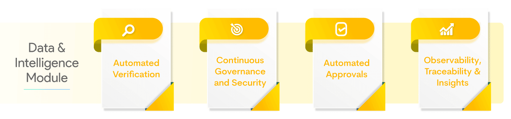

#**Data and Intelligence Module - Autopilot**#
OpsMx Autopilot is the intelligence layer for Software Delivery, it provides real-time analytics to automate data-driven risk assessments for software releases. Autopilot analyzes the risk of all changes, automatically determining the confidence that an update can be promoted to the next pipeline stage without introducing errors. Autopilot also automated policy compliance, ensuring that all your governance rules and best practices are followed. Autopilot reduces errors in production, increases release velocity, and improves security, quality, and compliance.

##**Overview**##

With Autopilot you get:

###**1. Automated Verification:**###
Reduce software risks by analysing logs and metrics at every stage of CI/CD process. Determine the risk of every update before deploying to production. Automatically analyse data from dynamic and static scans, functional tests, metrics, and logs to identify and highlight anomalies that should be considered before approval.
###**2. Continuous Governance and Security:**###
Mitigate risk and vulnerabilities by security and policy enforcement in software delivery pipelines. Provides comprehensive policy enforcement through an extensible policy engine that ensures compliance to industry standards and organizational policies while securely shipping your releases faster to production.
###**3. Automated Approvals:**###
Make faster and informed decisions to approve a delivery pipeline by 360° visibility of your CI/CD process. Perform informed application approval or promotion between different stages of software delivery (from QA to Staging & from staging to Production) through real-time  information about the release, including source code changes, build information, source code analysis, SAST/DAST tool analysis, risk verifications, and policy checks.
###**4. Observability, Traceability and Insights:**###
Collaborate more and make better decisions using real-time visibility and deep insights across your software deployments and delivery. Supports real-time Observability with respect to deployments and pipeline execution and traceability for all software delivery events, including what is getting delivered, who approved the release, and when it was approved.

<!-- blank line -->
<figure class="video_container">
  <iframe width="560" height="315" src="https://www.youtube.com/embed/aOFn8bF2lPA" title="YouTube video player" frameborder="0" allow="accelerometer; autoplay; clipboard-write; encrypted-media; gyroscope; picture-in-picture" allowfullscreen></iframe>
</figure>
<!-- blank line -->

<!-- blank line -->
<figure class="video_container">
  <iframe width="560" height="315" src="/ISD_Login.mp4" title="Local Video" frameborder="0" allow="accelerometer; autoplay; clipboard-write; encrypted-media; gyroscope; picture-in-picture" allowfullscreen></iframe>
</figure>
<!-- blank line -->
