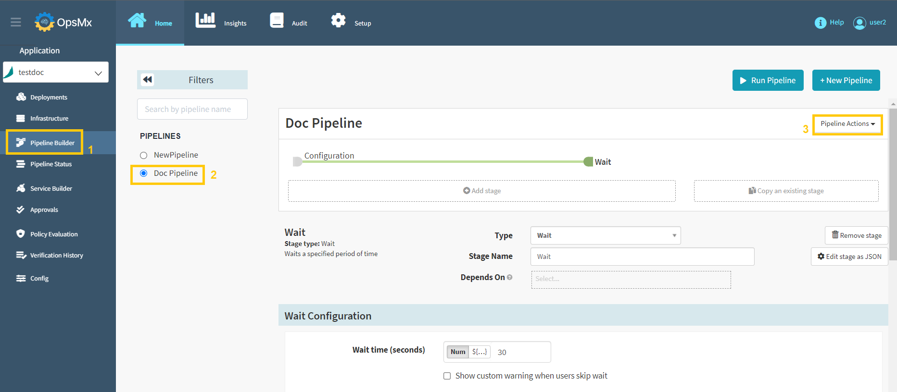
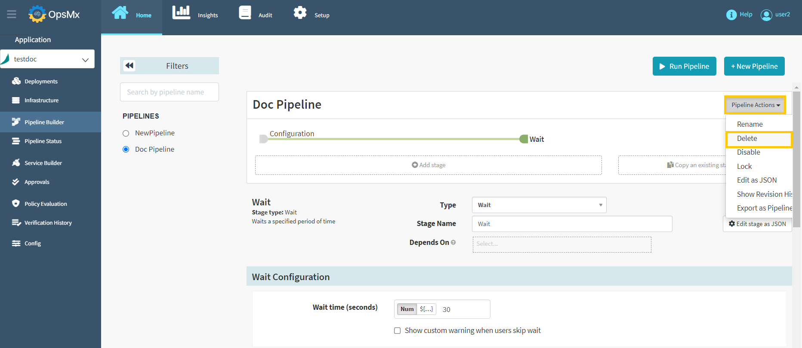
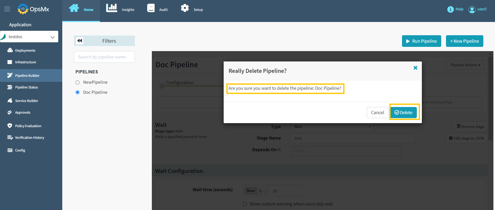
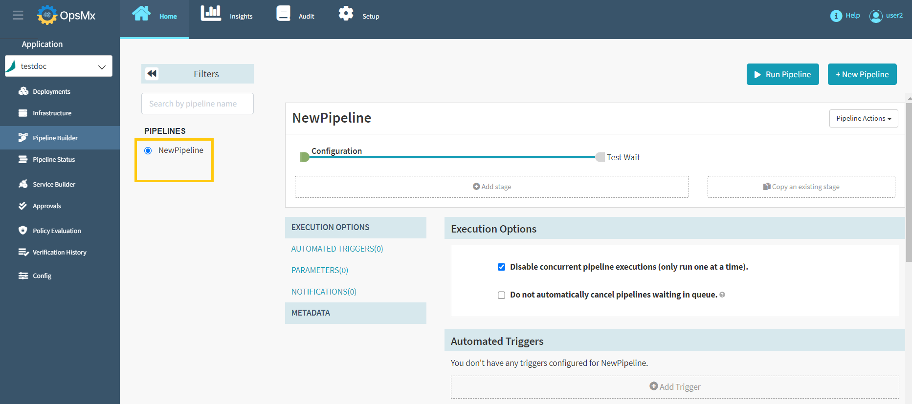

#**Delete Pipeline**#

If you delete a pipeline, a specific pipeline will be deleted permanently.

Follow the steps below to delete a pipeline:

1. Click on your application from the application dashboard and click "**Pipeline Builder**" and **select your pipeline** and then click "**Pipeline Action**" drop-down button.

	

2. Select "**Delete**" option from the **Pipeline Actions** drop-down menu as shown below.

	

3. Below screen will appear to confirm your pipeline deletion request. Make sure that you have selected the correct pipeline name and click "**Delete**".

	

4. Now the selected pipeline has been deleted and it is no longer available in the application as shown in the image below.

	