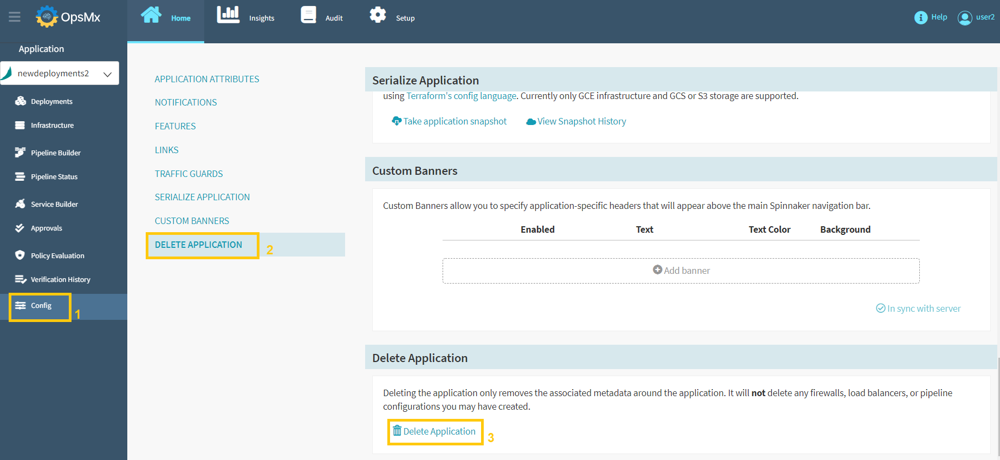
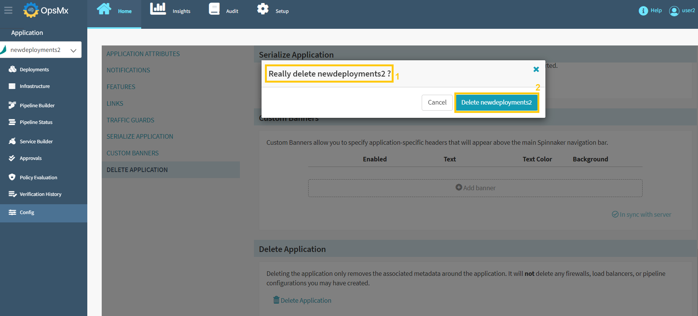
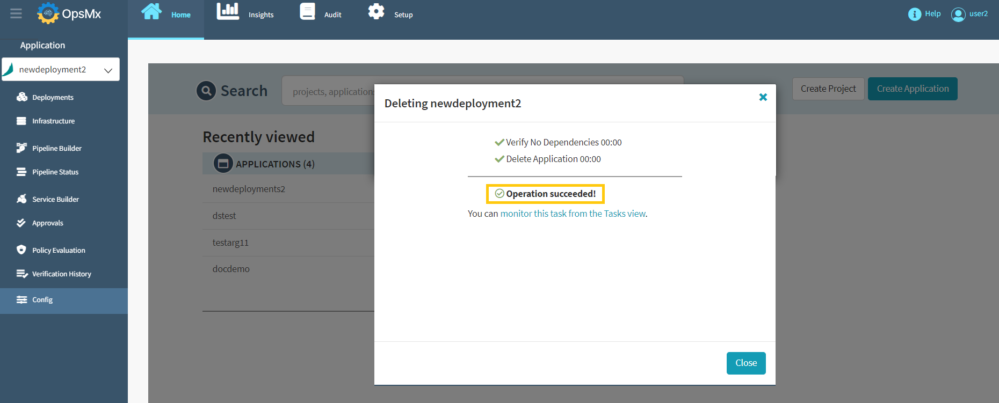

#**Delete an Application**#

Follow the below procedure to delete an application:

1. Click "**Config**" and select "**Delete Application**" from the left side menu and then click "Delete Application" from the bottom of the page as shown in the image below.

	

2.  Below screen will appear to confirm your application deletion request. Make sure that you have selected the correct application name and click "Delete application".

	

3.  Your application has been deleted successfully as shown below:

	