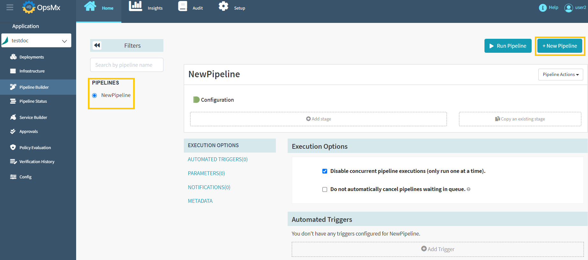
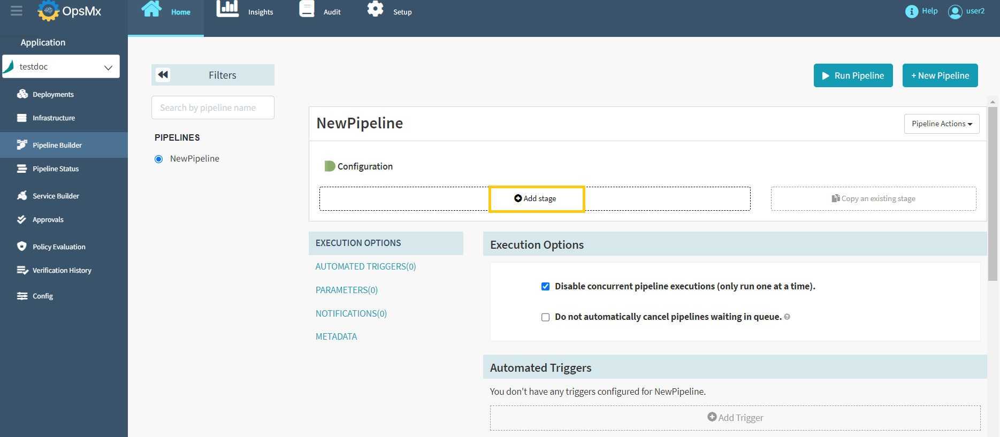
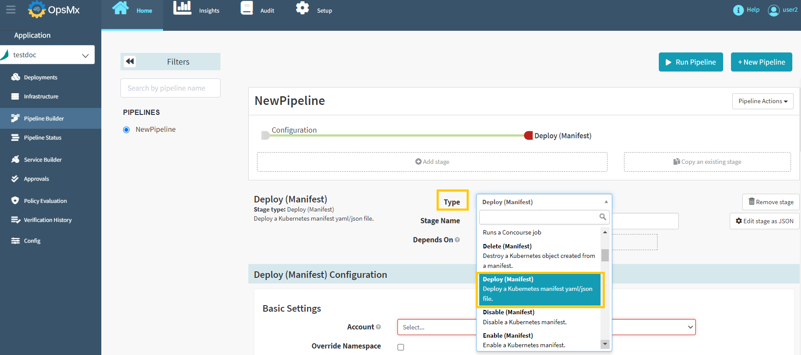
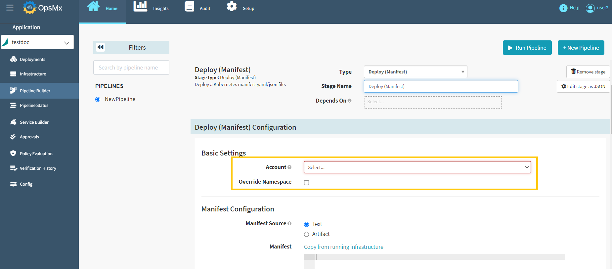

#**Deployment to Kubernetes namespace with Git based Manifest**#
A Kubernetes manifest is a text file that details a deployment. Deployment manifests however are usually 
stored in a repository like Github or bitbucket.

To deploy a manifest from ISD follow the steps below:

1. **Go to Application Dashboard**: When you log in to ISD you would start at the application dashboard. 
Users will see a list of applications or [create a new application](https://docs.opsmx.com/user-guide/manage-application/create-an-application) entirely. 
**Click on the application** where you want to build this pipeline. For the purposes of this tutorial, we are using the application “**testdoc**”.

	

2. **Pipeline Builder**: Once you click on an application, it will redirect you to the "Pipeline Status" page. 
Click "**Pipeline Builder**" navigate to the pipelines screen and then click "**+New Pipeline**" button 
to [create a new pipeline](https://docs.opsmx.com/user-guide/manage-pipelines/create-a-pipeline) as shown in the image below. 
Users can also view the existing pipelines on the left side of the screen.

	

3. **Click on “add stage”**: The add stage button is just under the diagrammatic representation of your pipeline. When you click this button, you can select many different types of stages that ISD supports.

	

4. **Select “Deployment”**: You can add a host of different stages using a drop-down menu. They are all alphabetically sorted. Scroll down and select “**Deploy(Manifest)**”.

	

5. **Select your account**: An account is a name given to a Kubernetes cluster.

	

6. **Select your namespace**: A namespace is a specific address within a Kubernetes cluster, select the checkbox that says override namespace and you will be able to select the namespace in which your manifest will deploy.

	

7. Define the file and the repository you are going to deploy the artifact from: Select "**Artifact**", and you will be prompted to select the repository which you are deploying from. 
In addition you must specify the **URL** of the artifact and the **branch** it is located in.

	

	* **Manifest Artifact:** The artifact that is to be applied to the Kubernetes account for this stage. The artifact should represent a valid Kubernetes manifest.

	* **Expression Evaluation:** Skip SpEL expression evaluation of the manifest artifact in this stage. Can be paired with the "Evaluate SpEL expressions in overrides at bake time" option in the Bake Manifest stage when baking a third-party manifest artifact with expressions not meant for Spinnaker to evaluate as SpEL.

	* **Required Artifacts to Bind:** These artifacts must be present in the context for this stage to be successfully completed. Artifacts specified will be [bound to the deployed manifest](https://spinnaker.io/docs/reference/artifacts-legacy/in-kubernetes-v2/#binding-artifacts-in-manifests).

	* **Rollout Strategy Options:** **If enabled**, allow Spinnaker to associate each ReplicaSet deployed in this stage with one or more Services and manage traffic based on your selected rollout strategy options.

8. After updating the above details, Click on "**Save Changes**" to deploy the Git based manifest.
 

