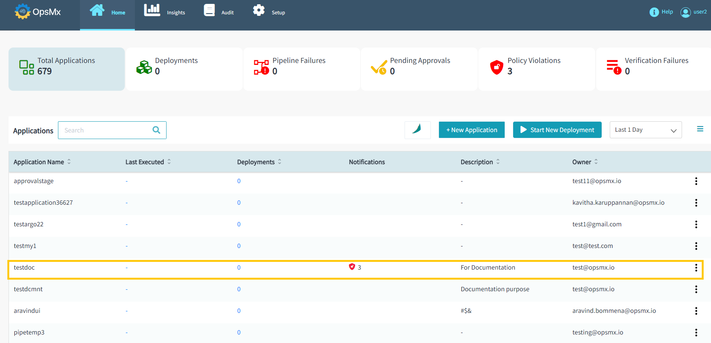
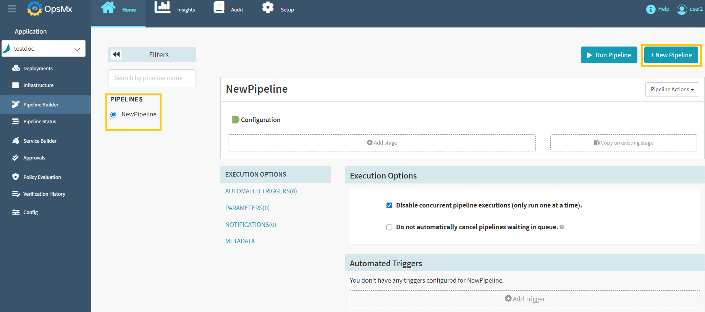
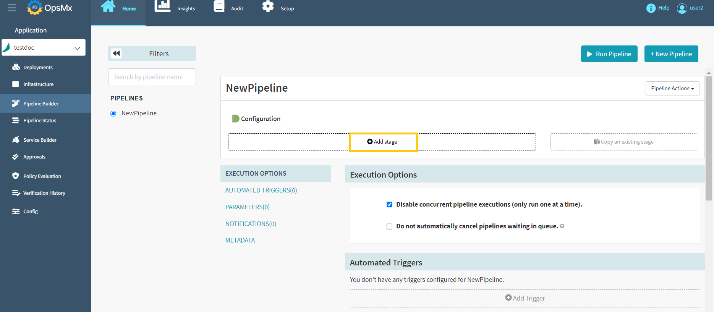
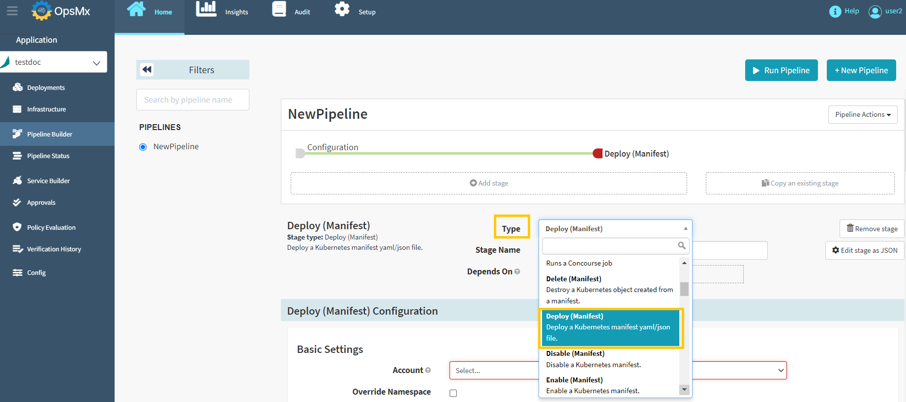
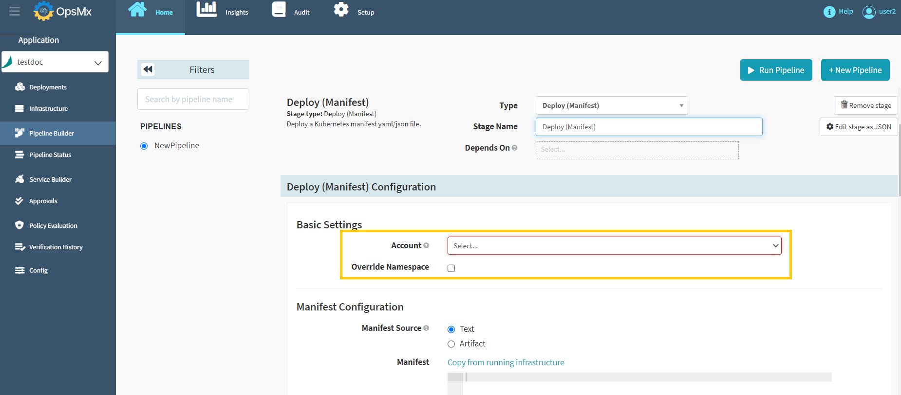
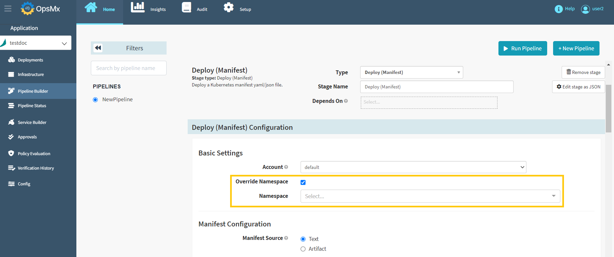
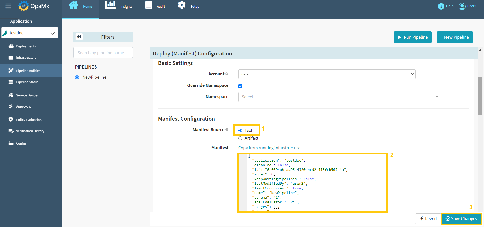

#**Deployment to Kubernetes namespace with Manifest file**#
A Kubernetes manifest is a text file that details a deployment. Deploying a Kubernetes Manifest using Spinnaker 
is easy and has out-of-the-box stages when you build your pipelines.

To deploy a manifest from ISD, follow the steps below:

1. **Go to Application Dashboard**: When you log in to ISD you would start at the application dashboard. 
Users will see a list of applications or [create a new application](https://docs.opsmx.com/user-guide/manage-application/create-an-application) entirely. 
**Click on the application** where you want to build this pipeline. For the purposes of this tutorial, we are using the application “**testdoc**”.

	

2. **Pipeline Builder**: Once you click on an application, it will redirect you to the "Pipeline Status" page. 
Click "**Pipeline Builder**" navigate to the pipelines screen and then click "**+New Pipeline**" button 
to [create a new pipeline](https://docs.opsmx.com/user-guide/manage-pipelines/create-a-pipeline) as shown in the image below. 
Users can also view the existing pipelines on the left side of the screen.

	

3. **Click on “add stage”**: The add stage button is just under the diagrammatic representation of your pipeline. When you click this button, you can select many different types of stages that ISD supports.

	

4. **Select “Deployment”**: You can add a host of different stages using a drop-down menu. They are all alphabetically sorted. Scroll down and select “**Deploy(Manifest)**”.

	

5. **Select your account**: An account is a name given to a Kubernetes cluster.

	

6. **Select your namespace**: A namespace is a specific address within a Kubernetes cluster, select the checkbox that says override namespace and you will be able to select the namespace in which your manifest will deploy.

	

7. **Add your manifest**: Kubernetes manifests are in YAML, which means you can store them as basic text objects and copy and paste them as needed, or you can store them as an artifact in a Git repository and configure the pipeline to fetch them from that repository. Select the "**Text**" option as manifest source and **add your manifest** as shown below.

	

8. After adding your manifest, Click on "**Save Changes**" to deploy your manifest.
 

