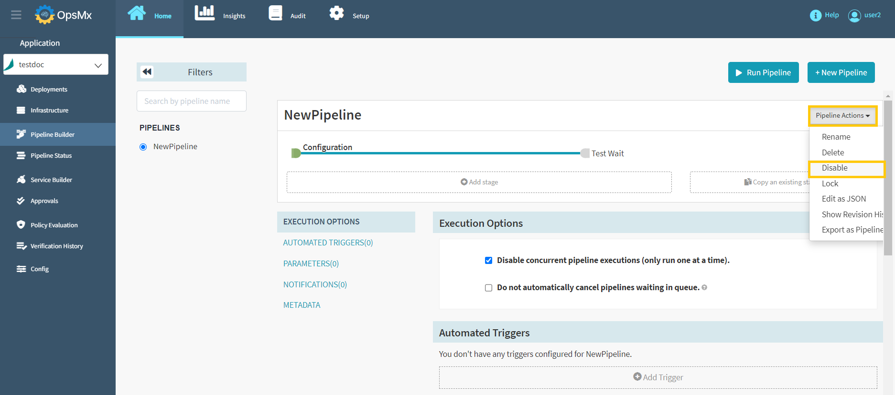
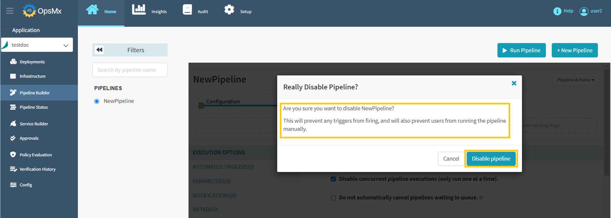
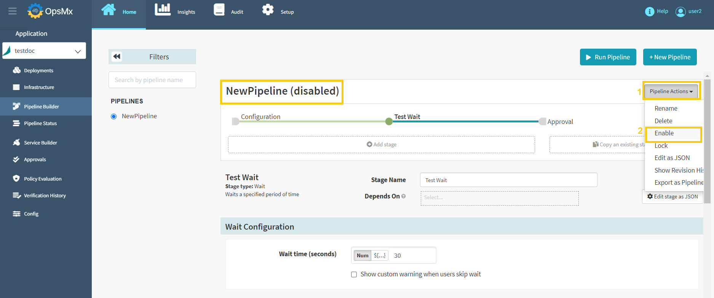

#**Disable Pipeline**#

If you disable a pipeline, it will prevent any triggers from firing. Also, manual execution of the pipeline is not possible for disabled pipelines.

Follow the steps below to disable a pipeline:

1. Click on your application from the application dashboard and click "**Pipeline Builder**" and **select your pipeline** and then click "**Pipeline Action**" drop-down button.

	

2. Select "**Disable**" option from the **Pipeline Actions** drop-down menu as shown below.

	

3. Below screen will appear to confirm your pipeline disable request. Make sure that you have selected the correct pipeline name and click "**Disable pipeline**".

	

4. Now the selected pipeline has been disabled as shown in the image below.

	

5.  For the disabled pipelines, "**Enable**" option will be available under the pipeline action drop-down menu to enable the specific pipeline.