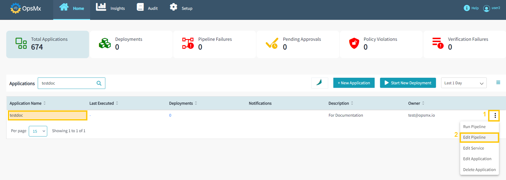
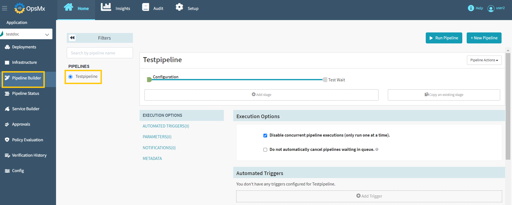
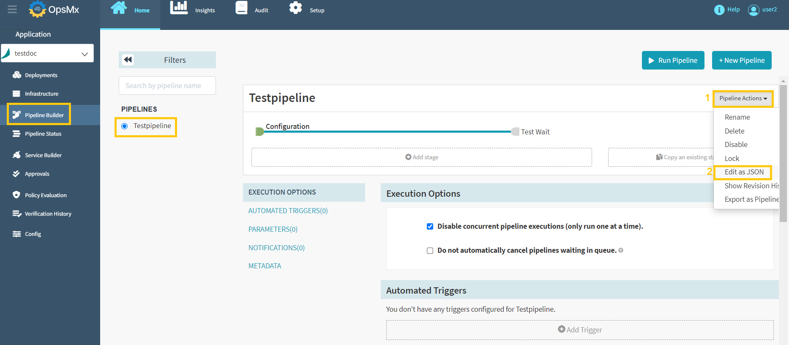
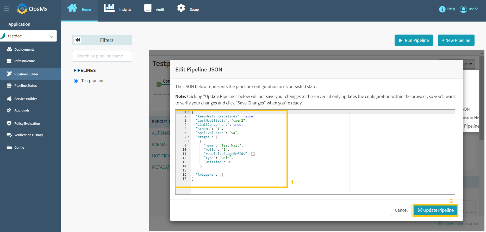

#**Edit Pipeline**#

**Follow the steps below to edit the pipeline you created:**

1. From the Application dashboard, select your application name which you need to edit a pipeline. Click "**Three dots**" at end of the application name and then select "**Edit Pipeline**" as shown in the image below.

	

2.  It will redirect you to the "**Pipeline Builder**" page, where you can modify your pipeline by selecting it from the left-hand side. Users can modify the available pipeline within the application as shown below.

	

##**Editing Pipeline as JSON**##

Whatever changes you make in a pipeline from the Spinnaker UI get converted to JSON. Hence, when you want to edit a pipeline you can do so through the Spinnaker UI, or you can edit the JSON of the pipeline to make changes to the pipeline.

Follow the steps below to edit the pipeline as JSON.

1. From the Application dashboard, select your application name which you need to edit a pipeline. Click "**Three dots**" at end of the application name and then select "**Edit Pipeline**" as shown in the image below.

	

2. It will redirect you to the "**Pipeline Builder**" page, where you can modify your pipeline by selecting it from the left-hand side. Users can modify the available pipeline within the application as shown below.

	

3. Click the "**Pipeline Actions**" button and select "**Edit as JSON**" from the drop-down menu as shown below.

	

4. Edit the JSON file to make the changes to the pipeline and click "**Update Pipeline**" as shown in the below image.

	

