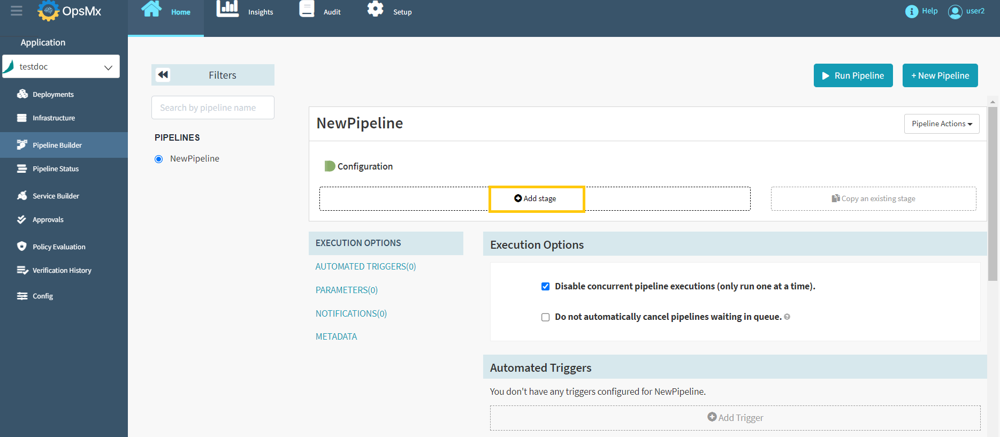

#**Helm based deployment to Kubernetes namespace**#
Helm Chart is a packaging tool for Kubernetes. It packages all of your disparate manifests as a singular object to advertise to your cluster. 

To deploy a helm chart, follow the steps below:

1. **Go to Application Dashboard**: When you log in to ISD you would start at the application dashboard. 
Users will see a list of applications or [create a new application](https://docs.opsmx.com/user-guide/manage-application/create-an-application) entirely. 
**Click on the application** where you want to build this pipeline. For the purposes of this tutorial, we are using the application **“testdoc”**.

	

2. **Pipeline Builder**: Once you click on an application, it will redirect you to the "Pipeline Status" page. 
Click "**Pipeline Builder**" navigate to the pipelines screen and then click "**+New Pipeline**" button 
to [create a new pipeline](https://docs.opsmx.com/user-guide/manage-pipelines/create-a-pipeline) as shown in the image below. 
Users can also view the existing pipelines on the left side of the screen.

	

3. **Click on “add stage”:** The add stage button is just under the diagrammatic representation of your pipeline. When you click this button, you can select many different types of stages that ISD supports.

	

4. **Add a Bake stage:** Select “**Bake(Manifest)**” stage from the drop down menu. Baking an artifact allows you to use this artifact later in your spinnaker pipeline, without having to define its parameters.

	

5. **Configure Bake(Manifest):** Select the **Render engine** from the drop down and provide the required details and then click "**Save Changes**" as shown in the image below.

	

	* **Render Engine:** This is the engine used for rendering your manifest.

	* **Helm name and namespace:** Defining the name and namespace specifies where in your cluster this artifact will deploy.

	* **Expected Artifact:** Select the template you want to render.

	* **Raw Overrides:** Use --set instead of --set-string when injecting override values. Values injected using --set will be converted to primitive types by Helm.

	* **Expression Evaluation:** Explicitly evaluate SpEL expressions in overrides just prior to manifest baking. Can be paired with the "Skip SpEL evaluation" option in the Deploy Manifest stage when baking a third-party manifest artifact with expressions not meant for Spinnaker to evaluate as SpEL.

6. **Add your deployment stage:** Now that you have baked an object, you don’t have to define its parameters. Much like our steps to create a Kubernetes deployment guide, 
you can either add it as a [text](https://docs.opsmx.com/user-guide/manage-pipelines/execute-pipelines-run-deployments/deployment-to-kubernetes-namespace-with-manifest-file) or 
as an [artifact](https://docs.opsmx.com/user-guide/manage-pipelines/execute-pipelines-run-deployments/deployment-to-kubernetes-namespace-with-git-based-manifest).
 
	

7. **Run your pipeline:** Verify to make sure that it works.