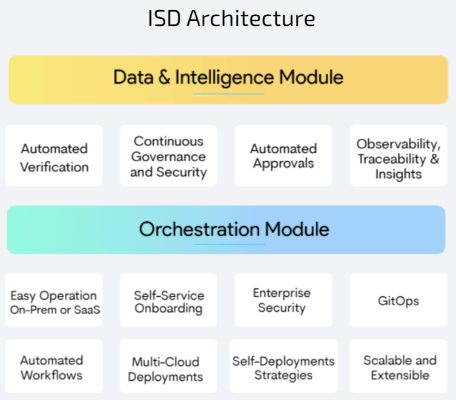

#**ISD Architecture**#
##**Architecture**##
The figure below depicts the component view of the ISD architecture. As mentioned earlier, it consists of two modules, 
Orchestration, and the Data & Intelligence module.

**ISD Services**

ISD consists of the following services.

1. **Autopilot** = Verification service

2. **SAPOR**  = connect with Spinnaker and git/S3 Repo for updating dynamic accounts

3. **Visibility**  = implementation of approval service

4. **Dashboard** = Collate data for graphical presentation of applications and pipelines

5. **OES-Gate** = Authentication gateway

6. **Sapor-gate** = OPTIONAL: spin-gate with basic-auth for Sapor communication

7. **Controller** = OPTIONAL: remote deployments (Not shown in the Schematic below)

8. **OES-UI**  = Serves the UI elements (Not shown in the Schematic below)

These services also use two databases:

1. OES-db : Postgres DB customized for OES

2. OES-redis : Used by OES-gate

Apart from these, OES includes all the Spinnaker components, configured in HA mode. Spinnaker services functional 
roles are as follows:

* Deck (GUI)
* Gate (API)
* Clouddriver (Deployments)
* Orca (Orchestrator)
* Echo (Notifications)
* Front50 (DB Frontend)
* Redis (Execution cache)

Key communication paths in the ISD:

1. SAPOR Service communicates with the Spinnaker Gateway and makes API calls to retrieve data, update pipelines, etc.

2. SAPOR can also be configured to use Sapor-gate which uses Basic Authentication. 
This is useful in cases where Spinnaker is configured with 2-factor authentication.

3. Application is designed based on API-gateway architecture. All data from the web-browser goes through:
	* OES-gate  or
	* Spin-gate 

##**Ingress**##
ISD requires 5 ingress points:

1. Spinnaker UI : spin-deck service on port 9000

2. Spinnaker Gate: spin-gate service on port 8084

3. OES UI: OES-UI service on port 8080
 
4. OES gate: OES-API service on port 8084

5. Controller: For an agent to contact the controller, we need an ingress/LB. 
Note that TLS + gRPC traffic needs to be routed to the controller, shown in red.

 

