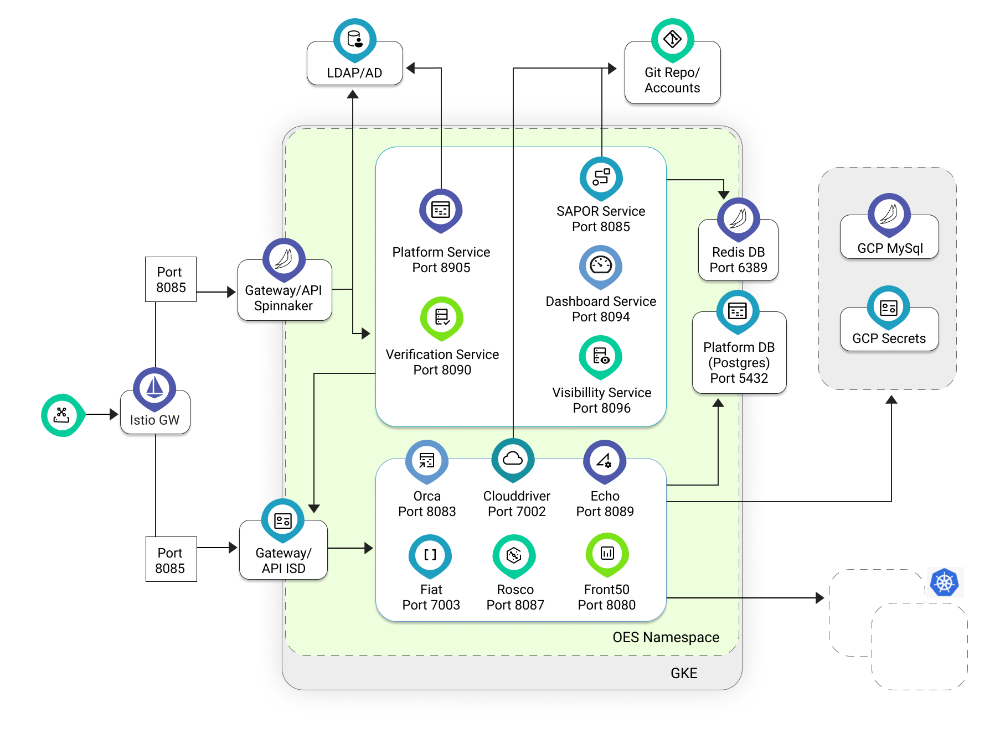
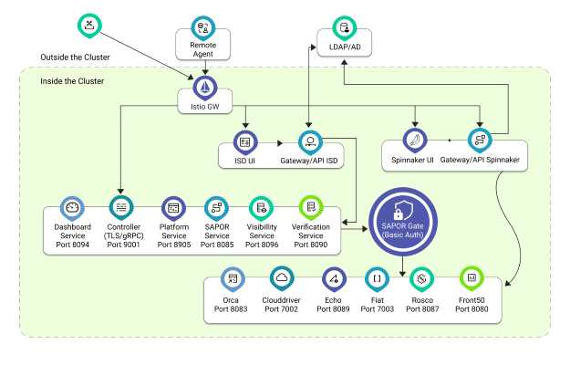
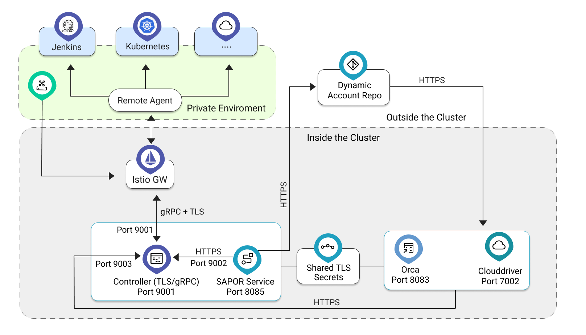
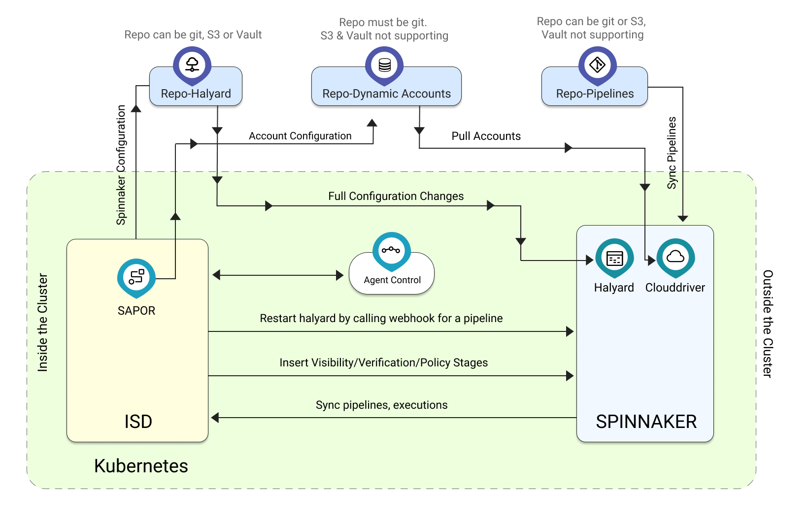

#**ISD Deployment Architecture**#
##**Introduction**##
ISD is an application layer built on top of Spinnaker that provides value-added services such as 
verification gates, approval gates, and Policy enforcement.

##**ISD Components**##
It consists of the following services:

* Autopilot = Verification service

* SAPOR = Connect with Spinnaker and git/S3 Repo for updating dynamic accounts

* Visibility = Implementation of approval service

* Dashboard = Collate data for graphical presentation of applications and pipelines

* oes-Gate = Authentication gateway

* Sapor-gate = OPTIONAL: spin-gate with basic-auth for Sapor communication

* Controller = OPTIONAL: remote deployments (Not shown in the Schematic below)

* oes-ui  = Serves the UI elements (Not shown in the Schematic below)

These services also use two databases:

* Oes-db : Postgres DB customized for oes
* oes-redis : Used by oes-gate

Apart from these, OES includes all the Spinnaker components, configured in HA mode. Spinnaker services functional 
roles are as follows:

* Deck (GUI)

* Gate (API)

* Cloud driver (Deployments)

* Orca (Orchestrator)

* Echo (Notifications)

* Front50 (DB Frontend)

* Redis (Execution cache)

The schematic is as follows:

Key communication paths in the ISD:

1. SAPOR Service communicates with the Spinnaker Gateway and makes API calls to retrieve data, update pipelines, etc.

2. SAPOR can also be configured to use Sapor-gate which uses Basic Authentication. This is useful in cases where Spinnaker 
is configured with 2-factor authentication.

3. Application is designed based on API-gateway architecture. All data from the web browser goes through:

	* OES-gate
	* Spin-gate

##**Ingress**##
ISD requires three to five ingress points:

1. Spinnaker UI : spin-deck service on port 9000

2. Spinnaker Gate: spin-gate service on port 8084

3. OES UI: oes-ui service on port 8080

4. OES gate: oes-api service on port 8084 == this can be used as “common gate: for OES and Spinnaker

5. Controller: For agent to contact the controller, we need an ingress/LB. Note that TLS+gRPC 
traffic needs to be routed to the controller, shown in red. This is optional

The schematic including ingress is as follows(Istio ingress is only an example):

##**Controller Configuration**##
The controller allows for deploying to remote clusters that may not have inbound network access. 
All communication between Spinnaker and the remote cluster is routed via a controller and an agent. 
The controller is automatically installed and configured for use in OES 3.5 and beyond.

##**Overview**##
Spinnaker is configured to use the controller as the “target” server for various functions. 
For example, for a remote kubernetes account, Spinnaker will get a kubeconfig file where the server 
address is that of the controller. Similarly, for Jenkins, AWS, and other remote servers, the server 
name is replaced with that of the controller. The controller forwards all the http traffic to the agent, 
which then re-transmits them to the real, target server (kube-API server, jenkins server, etc.).

In the schematic above communication shown in red uses shared TLS certificates making the communication 
extremely secure. Self-signed certificates are generated by default and can be replaced post-installation.

Dynamic account configuration must be used for the controller configuration to work from OES-UI.

Key points:

* All communication with the controller is HTTPS or TLS

* Agent communication with the controller is TLS over gRPC

* The controller needs to be provided with a CA and Key as it generates the tls-certs for all other parties.

As we use, by default, a self-signed CA, all other parties i.e. SAPOR and Spinnaker-services need to trust this CA. 
All this is handled by the helm-install process.

What is happening behind the scenes:

1. There is a job (“create-secrets”) that creates two secrets:

	* ca-secret : This contains CA-cert and key. This is used by the controller for stamping out all other certificates

	* oes-control-secret: This contains the TLS cert+key that is used by SAPOR to contact the 
controller [Note: oes-control-secret was called oes-command-secret before 3.7]

2. Whenever a user turns the “remote” slider button in OES->settings->cloud-accounts->create account, 
SAPOR connects to the controller to check if it is reachable.

3. On “save”, sapor makes API calls to the controller and creates:

	* A kubeconfig file, that is updated in the git-repo for dynamic accounts and is eventually used by 
Spinnaker for deployment

	* A manifest YAML file is available for download.

4. The user is expected to download the YAML manifest and apply it in the remote cluster.

While the schematic shows one controller and one agent, the system supports multiple agents in multiple clusters in 
HA mode i.e. there can be multiple controllers and agents.

The controller is written in golang and has been open-sourced. Source code can be downloaded from:
[https://github.com/OpsMx/oes-birger](https://github.com/OpsMx/oes-birger)

##**Deployment and Upgrade**##

ISD is provided in a helm package and is installed using the helm command. The helm install does the following:

1. Processes values.yaml file and processes all the helm templates

2. All kubernetes objects are applied in the given namespace

3. Pipeline-gitops secrets and config maps are created in the “default” namespace.

4. There are two jobs that have do additional functions:

	* Create secrets for the controller CA configuration

	* Automatically configure Github, Spinnaker, Autopilot, and OPA integrations based on the values 
provided in values.yaml

The upgrade is done using helm as well. The upgrade ensures that the two Jobs executed during the installation process 
are not re-executed.

##**GitOps Configuration**##
GitOps is an operational paradigm that says that the target environment is in sync with a git repo. 
While we do not have full GitOps, the model being followed can be extended to GitOps in the future.

Fundamentally, all the configuration information for Spinnaker is stored in a directory “.hal” inside the halyard-pod. 
The “normal” spinnaker installation requires a persistent store (PV) to be mounted at this mount point (/home/spinnaker).

In gitOps halyard, we have an init container in the statefulset that clones a git-repo (or Vault or S3) and processes 
the files before placing them in .hal directory. There is no persistent storage, thereby reducing the associated security risks.

Any change required can be done in the git-repo. Once the halyard pod is restarted, the changes become effective.

The schematic looks as follows:

While the schematic shows three repositories, it is possible to use one repository for all three purposes.
 

