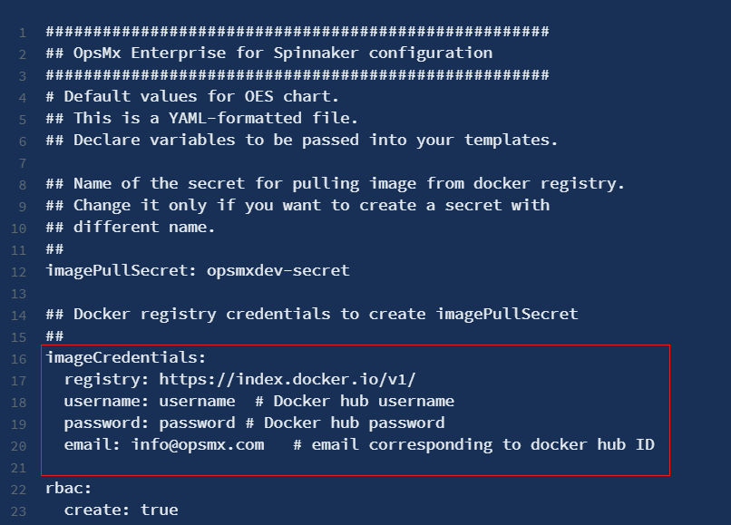

#**ISD Installation Configuration**#

##**ISD Installation Configuration**##

In order to configure ISD, first you have to download the ```values.yaml``` file. 
This file specifies the values for the parameters which are provided while installing the chart. 
To download the file execute the following command:

```
wget https://raw.githubusercontent.com/opsmx/enterprise-spinnaker/master/charts/oes/values.yaml
```

Once you run the above command, the ```values.yaml``` file is downloaded in your local machine. 

Open the ```values.yaml``` file in an editor of your choice. The file will look like as shown below:

```
#####################################################
## OpsMx Enterprise for Spinnaker configuration
#####################################################
# Default values for OES chart.
## This is a YAML-formatted file.
## Declare variables to be passed into your templates.

## Name of the secret for pulling image from docker registry.
## Change it only if you want to create a secret with
## different name.
##
imagePullSecret: opsmxdev-secret

## Docker registry credentials to create imagePullSecret
##
imageCredentials:
  registry: https://index.docker.io/v1/
  username: username  # Docker hub username
  password: password # Docker hub password
  email: info@opsmx.com   # email corresponding to docker hub ID

rbac:
  create: true

## Option to skip installation of spinnaker, if it already exists
## or if OES is to be connected to existing spinnaker
##
installSpinnaker: false

## Installation mode
## Available installation modes OES-AP, OES, AP
##
installationMode: OES-AP

## Set to true to expose spinnaker and deck services as LoadBalancers
##
createIngress: false

## OES UI & Gate service type
##
k8sServiceType: LoadBalancer

```

!!! Note
    The above file is just a sample of the original file and does not consist all the parameters.

In the above file, you can edit or customize the parameters as per your requirement. For example - 
Change the username, password or email under the ```imageCredentials``` section as shown below:



Similarly you can change the other parameters also. The following table lists the configurable parameters of the 
ISD chart and their default values:  

  <head>
    <title>Title of the document</title>
    <style>
      table,
      th,
      td {
        padding: 2px;
        border: 1px solid black;
        border-collapse: collapse;
      }
    </style>
  </head>

| Parameter    |Description   | Default        |
|:------------ |:------------:|:--------------:|
| ```imagePullSecret``` | Name of the image pull secret to fetch oes docker images from private registry | ```opsmxdev-secret``` |
| ``` imageCredentials.registry``` | The registry where OES docker images are available     | ```https://index.docker.io/v1/``` |
| ```imageCredentials.username``` | Username of docker account to access docker registry      | ```dockerID``` |
| ```imageCredentials.password``` | Password of docker account | ```dockerPassword``` |
| ```imageCredentials.email``` | Email associated with docker account | ```info@opsmx.com```|
| ```rbac.create``` | Enable or disable rbac| ```true``` | 
| ```installSpinnaker``` | If true, install Spinnaker along with OES Extensions | ```true``` |
| ```installationMode``` | The installation mode. Available installation modes are **OES-AP** (both OES 3.0 and Autopilot), **OES** (Only OES 3.0) and **AP** (Only Autopilot) and **None** (Skip OES installation) | ```OES-AP``` |
| ```createIngress``` | If true, exposes Spinnaker deck & gate services over Ingress | ```false``` |
| ```oesUI.protocol``` | Change this to https if TLS is enabled for ingress endpoint | ```http``` |
| ```oesUI.host``` | Host using which UI needs to be accessed | ```oes.domain.com``` |
| ```k8sServiceType``` | Service Type of oes-ui, oes-gate, spin-deck-ui, spin-gate | ```LoadBalancer``` |
| ```installRedis``` | If false, OES will uninstall its own Redis for caching | ```false``` |
| ```redis.url``` | Set custom URL if installRedis is set to false | ```redis://{{ .Release.Name }}-redis-master:6379``` |
| ```db.enabled``` | Set it to false if OpsMx DB is already installed on cluster or if any external database is to be used. | ```true``` |
| ```db.url```| URL of the external DB if not using OpsMx DB. | ```jdbc:postgresql://oes-db:5432/opsmx``` |
| ```db.storageMountSize``` | Storage to be allocated to OpsMx DB | ```8Gi``` |
| ```autopilot.config.buildAnalysis.enabled``` | Set it to false to disable build analysis | ```false``` |
| ```autopilot.config.ssl.enabled``` | Set it to true to enable SSL | ```false``` |
| ```autopilot.config.ssl.keystore``` | SSL keystore value | ```keystore.p12``` |
| ```autopilot.config.ssl.keyStorePassword``` | SSL keystore password | ```dummypwd``` |
| ```autopilot.config.ssl.keyStoreType``` | SSL keystore type | ```PKCS12``` |
| ```autopilot.config.ssl.keyAlias``` | SSL key alias | ```tomcat``` |
| ```dashboard.spinnakerLink``` | Specify if dashboard needs to be configured with a different spinnaker | ```{{ .Values.spinnaker.ingress.protocol }}://{{ .Values.spinnaker.ingress.host }}``` |
| ```gate.config.oesUIcors```| Regex of OES-UI URL to prevent cross origin attacks| ``` `^https?://(?:localhost```|
| ```gate.config.fileBasedAuthentication```| Set it to true to disable LDAP authentication and enable file based authentication| ```false``` |
| ```platform.config.adminGroups``` | Admin groups available| ```admin, Administrators```|
| ```platform.config.userSource``` | Source of Users for authorization | ```ldap``` |
| ```platform.config.supportedFeatures``` | List of features to be supported by OES | ```[deployment-verification, services, releases, policies]``` |
| ```sapor.config.spinnaker.authnEnabled``` | Set it to true if authentication is enabled in Spinnaker | ```false``` |
| ```sapor.config.spinnaker.spinGateURL``` | URL of Spinnaker Gate | ```http://spin-gate.oes-spin:8084``` |
| ```sapor.config.spinnaker.spinExternalGateURL```| Set the external IP address of spin-gate, this is used to redirect to the spinnaker pipelines from OES-UI| ```http://spin-gate.oes-spin:8084``` |
| ```sapor.config.spinnaker.ldap.ldapEnabled``` | Is LDAP authn enabled for spinnaker | ```true``` |
| ```sapor.config.spinnaker.ldap.ldapUsername``` | Spinnaker username | ```admin``` |
| ```sapor.config.spinnaker.ldap.ldapPassword``` | Spinnaker password | ```opsmxadmin123``` |
| ```sapor.config.spinnaker.x509.enabled``` | Is x509 cert authn enabled for spinnaker | ```false``` |
| ```sapor.config.spinnaker.x509.client.password``` | Password of x509 client certificate | ```changeit``` |
| ```sapor.config.kubernetes.agent.enabled``` | Option to enable oes kubernetes agent | ```true``` |
| ```sapor.config.caCerts.override```| If default java certs are to be overwritten, create custom config map 'oes-sapor-cacerts.yaml' under templates and set this option to true | ```false``` |
| ```ui.config.setApplicationRefreshInterval```| Interval at which UI refreshes application dashboard| ```16000``` |
| ```visibility.config.configuredConnectors``` | Integrations options | ```JIRA,GIT,AUTOPILOT,SONARQUBE,JENKINS``` |
| ```visibility.config.logLevel```| Default Log Level| ```ERROR``` |
| ```autoConfiguration.enabled``` | Option enables OES to be configured automatically. Load Balancer IPs will be automatically replaced in the configuration files of oes-gate, oes-ui & sapor. Set it to false if OES is being installed on restricted environment. | ```true``` |
| ```autoConfiguration.initContainer.externalIpCheckDelay```| Expected delay in assigning load balancer IPs to oes-ui & oes-gate in secs | ```180``` |
| ```opa.enabled```| Enable OPA with OES | ```true``` |
| ```installOpenLdap``` | If true, installs Open LDAP server | ```false``` |
| ```openldap.adminPassword``` | Password to be set for admin user of LDAP | ```opsmxadmin123```|
| ```ldap.enabled```| Set it to true if LDAP is to be enabled for OES | ```true``` |
| ```ldap.url``` | URL of LDAP server | ```ldap://{{ .Release.Name }}-openldap:389``` |
| ```spinnaker.enableHA``` | Enable HA for orca & echo | ```true``` |
| ```spinnaker.enableCentralMonitoring```| Enable monitoring for Spinnaker | ```false``` |
| ```spinnaker.gitops.Halyard.enabled``` | Enable gitops style Halyard and account config | ```false``` |
| ```spinnaker.gitopsHalyard.mTLS.enabled``` | Enable mTLS for Spinnaker Services and SSL for Deck and Gate | ```false``` |
| ```spinnaker.gitopsHalyard.mTLS.deckIngressHost``` | Ingress host for deck | ```spindeck.{{ .Release.Name }}.domain.com``` |
| ```spinnaker.gitopsHalyard.mTLS.gateIngressHost``` | Ingress host for gate | ```spingate.{{ .Release.Name }}.domain.com``` |
| ```spinnaker.gitopsHalyard.repo-type``` | Repo type; git, s3, vault | ```git``` |
| ```spinnaker.gitopsHalyard.secretName```| Secret in which git credentials shall be specified, sample secret found under templates/secrets/ | ```opsmx-gitops-auth``` |
| ```spinnaker.gitopsHalyard.spinnakerLBCheckDelay``` | Timeout while fetching LB IPs of spin-deck and spin-gate to configure in hal config in seconds | ```180``` |
| ```spinnaker.gitopsHalyard.gatex509.enabled``` | Flag to enable x509 authentication for gate and use it for webhooks | ```false``` |
| ```spinnaker.gitopsHalyard.gatex509.host```| Separate host for using x509 authentication | ```spingate-x509.domain.com``` |
| ```spinnaker.gitopsHalyard.pipelinePromotion.enabled``` | To Enable pipeline promotion from one environment to another | ```false``` |

After you have changed the above mentioned properties as per your requirement, install the OES package with the 
customized ```values.yaml``` file to apply the changes. To do so, execute the following command:

```
helm install my-release opsmx/oes -f values.yaml
```