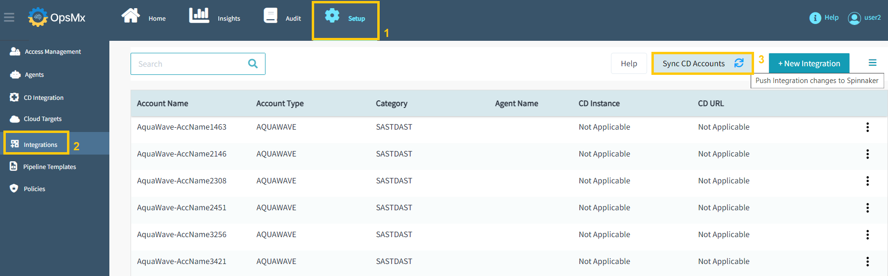

#**ISD Quick Installation**#
To experience ISD quickly, you can install it and deploy your applications. 
The instructions below are intended to get you started quickly and try out ISD functionality.

!!! Note
    The instructions below are not suitable for production or any other environment where security is a concern.

The page helps you to install ISD quickly with the following five simple steps.

###**Pre-requisites**###

* You should have access to a Kubernetes cluster with at least **2 nodes**
* Each node should have a minimum of **32 GB RAM** and kubectl set-up.

**Execute the following commands** (copy-paste in a terminal window):

```
kubectl create namespace opsmx-isd
kubectl -n opsmx-isd apply -f https://raw.githubusercontent.com/OpsMx/isd-quick-install/main/isd312/isd-gitea-quick.yaml 
kubectl -n opsmx-isd get po
kubectl -n opsmx-isd  port-forward svc/oes-ui 8080
```

Now open your browser and navigate to **http://localhost:8080** and login using the administrator's username and password.

After login to ISD, please go to "**Setup**"--> "**Integrations**" --> and click "**Sync CD Accounts**" to complete 
the post-installation setup.




 

