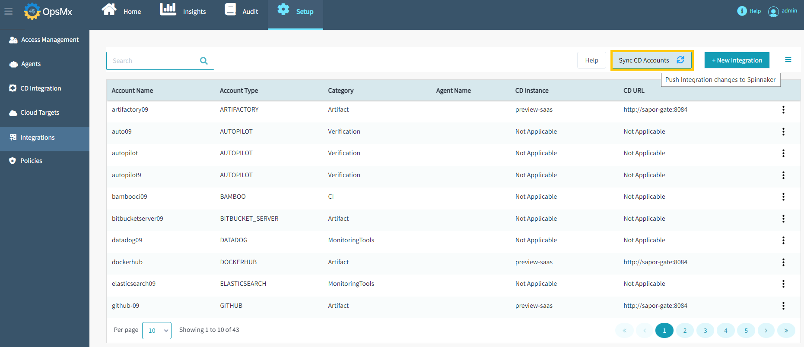

#**Integrations**#

Integrations are a cornerstone of ISD. They bring together a disparate set of tools from each stage of your CI/CD process under one 
centralized system and allow ISD’s to provide a detailed assessment of the risk of deployment and make the optimal decision on par 
with a human decision maker.

Integrations can also help your team coordinate and control your CI/CD process by supporting integrations with notification tools 
like slack and Microsoft teams.

##**Add Integration**##

Suppose you wanted to add an ElasticSearch integration as your data source to allow autopilot to perform your log analysis, to add the details follow the steps given below:

1. From the ISD application dashboard, click "**Setup**" --> Click "**Integrations**" and then Click "**New Integration**" button as shown in the image below.

	

2. The list of available integrators along with their respective fields appears as shown below. **Select the integration** you want to add and **fill out the information** about it that appears on the right pane of the screen. Once you have filled out all the information, click "**Save**".

	

	!!! Note
   	    [Click here](https://docs.opsmx.com/additional-resources/previous-releases/isd-3.12/opsmx-intelligent-software-delivery-platform/system-setup/data-sources/available-integrations) to know more about the all the integrations 
            supported and the corresponding information to be provided to add that integration.

##**Sync CD Accounts**##

Upon adding an integration, you can select another integration and add it. When you are done adding all the integrations you need to let 
these integrations sync with the Spinnaker so that these integrations can be used during pipeline execution. Click on the 
"**Sync CD accounts**" button to sync all the integrations with the Spinnaker, as shown below.

Sync'ing accounts with Spinnaker requires Spinnaker restart and it may take about 3-5 mins for the restart to complete. It is hence recommended to first add all the integrations and then sync them all together with Spinnaker at once. 

When you click on "**Sync CD accounts**" button, you would be prompted to confirm the restart action, as shown in the below.

As shown above, while the Spinnaker is getting restart, the users of the OES system will not be impacted. 
You can either choose to cancel the Spinnaker restart or can choose to proceed with the restart. 
If you choose to proceed with the restart, a confirm message would be displayed to the user about the start of the restart operation, 
as shown below.

Once created the integration will appear in the list of Accounts as shown below:

##**Edit Integration**##

To edit the details of integration, click the icon beside Account type and select **Edit** as shown below:

Edit the details as required, and click **Save** as shown below:

##**Delete Integration**##

To delete an integration, click the icon beside Account type and select Delete as shown below:

The confirmation message appears, click **Yes, Delete it!** Refer to the image below:

