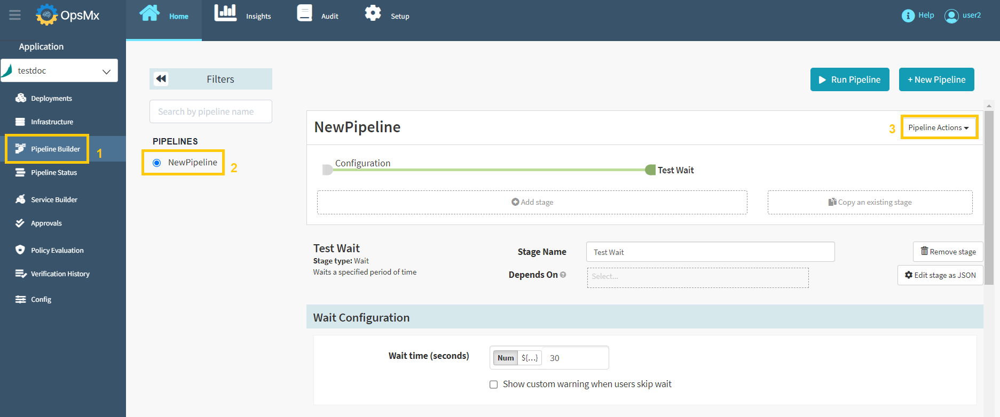
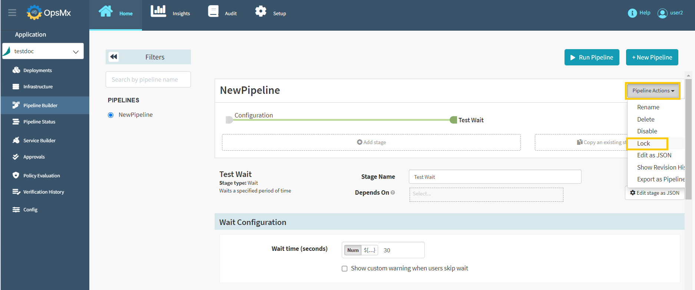
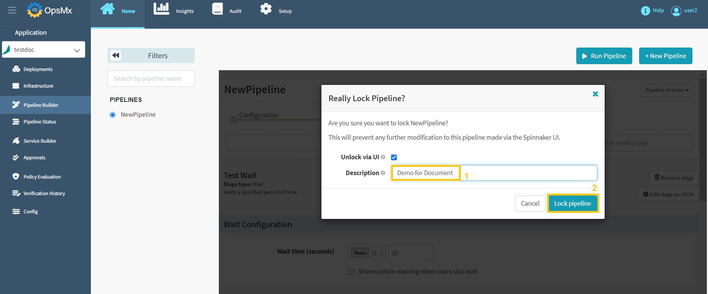
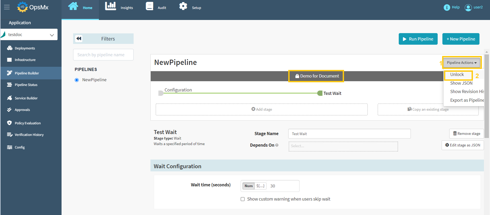

#**Lock Pipeline**#

If you lock a pipeline it will prevent any modifications to the pipeline from the UI. You can still modify the pipeline using the API. 

Follow the steps below to lock a pipeline.

1. Click your application from the application dashboard and click "**Pipeline Builder**" and **select your pipeline** and then click "**Pipeline Action**" drop-down button.

	

2. Select "**Rename**" option from the **Pipeline Actions** drop-down menu as shown below.

	

3. Below screen will appear to confirm your pipeline lock request. Make sure that you have selected the correct pipeline name and update the description of why this pipeline is locked and then click "**Lock pipeline**". 

	!!! Note
   		**After clicking "Lock Pipeline", this pipeline will be locked and does not allow modification.** 

	

4. Now the selected pipeline has been locked and the locked description appears as shown in the image below.

	

5.  For the locked pipelines, "**Unlock**" option will be available under the pipeline action drop-down menu to unlock the specific pipeline as shown in the above image.