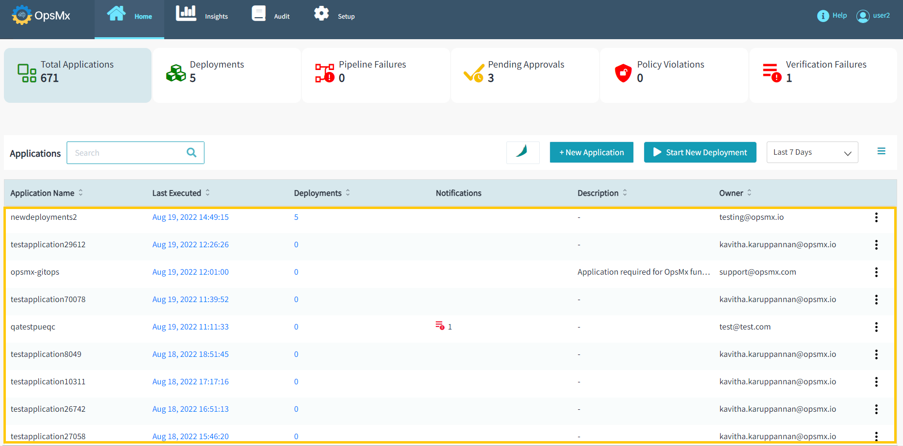

#**Manage Application**#

##**Applications**##

An application is the service or series of services that you are going to deploy to fulfill a definite purpose or series of purposes. For example, a banking application allows you to perform multiple different actions like checking your account balance, transferring funds between accounts, and so on.

The difference between an application and a service is subtle as Spinnaker does not natively distinguish between the two. However, to clarify, an application can consist of many different services and represents the overall product you are trying to deploy, while a service is more so the individual features of that product you are trying to deploy. This distinction allows you to better manage applications.

After your successful login to your ISD application, you would see the **application dashboard** as shown below. Here you can see the list of applications that appears which you created or which you have the relevant permissions.

To know more about the application dashboard, **refer [here](https://docs.opsmx.com/release-history/previous-releases/isd-4.0/user-guide/dashboard/application-dashboard)**.

ISD provides the capability to create new ISD applications and modify the existing applications. Applications shown in the above figure depict the name of the application which you have created and to which you have access. 

* To **create an ISD application** follow the instructions provided **[here]()**.
 
* To **configure the existing ISD application** follow the instructions provided **[here]()**. 

 

