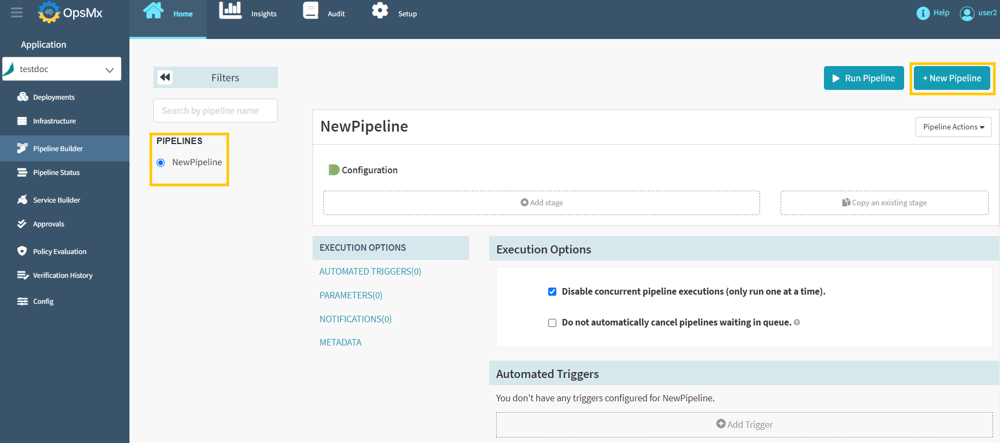

#**Manual Approval before deployment**#
A Manual Judgment is a stage you can add to a Spinnaker Pipeline whenever you require Human intervention in the process. 
If you want to have a human verify the deployment before it takes place, then a user can add a manual judgment stage before deployment.

To add a manual Judgment stage:


1. **Go to Application Dashboard**: When you log in to ISD you would start at the application dashboard. 
Users will see a list of applications or [create a new application](https://docs.opsmx.com/user-guide/manage-application/create-an-application) entirely. 
**Click on the application “testdoc”**.

	

2. **Pipeline Builder**: Once you click on an application, it will redirect you to the "Pipeline Status" page. 
Click "**Pipeline Builder**" navigate to the pipelines screen and then click "**+New Pipeline**" button 
to [create a new pipeline](https://docs.opsmx.com/user-guide/manage-pipelines/create-a-pipeline) as shown in the image below. 
Users can also view the existing pipelines on the left side of the screen.

	

3. **Click on “add stage”:** The add stage button is just under the diagrammatic representation of your pipeline. When you click this button, you can select many different types of stages that ISD supports.

	

4. **Add manual Judgment stage:** Select **“Manual Judgment”** stage from the drop down menu. You should add each stage and configure them in a logical sequence as ISD does not permit downstream dependencies.

	

5. **Configure Manual Judgment:** Configuring the manual judgment stage allows you to define input options a user can give and how they might give them. Update the required details in the below screen and click "**Save Changes**".

	

	* **Instructions (Optional):** Provide any instructional text that would assist in making a manual judgment (can contain HTML). These Instructions are shown to the user when making a manual judgment.

	* **Propagate Authentication:**

		* **If Checked** - The pipeline will continue with the permissions of the approver.

		* **If Unchecked** - The pipeline will continue with its current permissions.

	* **Judgment Inputs (Optional):**  Entries populate a dropdown displayed when performing a manual judgment. The selected value can be used in a subsequent **Check Preconditions** stage to determine to branch. For example, if the user selects "rollback" from this list of options, that branch can be activated by using the expression: ```execution.stages[n].context.judgmentInput=="rollback"```

	* **Send Notifications (Optional):** If the user needs an instant alert, can opt this. 


6. **Add your deployment stage:** Much like our steps to create a Kubernetes deployment guide, you can either add it as a [text](https://docs.opsmx.com/user-guide/manage-pipelines/execute-pipelines-run-deployments/deployment-to-kubernetes-namespace-with-manifest-file) or as an [artifact](https://docs.opsmx.com/user-guide/manage-pipelines/execute-pipelines-run-deployments/deployment-to-kubernetes-namespace-with-git-based-manifest).

	

7. **Run your pipeline:** Verify to make sure that it works.
 


