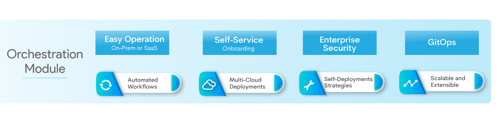

#**OES Features**#
OES has a wide range of tools and conveniences that allow developers, Managers and SRE’s to develop, 
build and deploy software faster, better with less friction. Below you can find the eight key features of OES:

1. **Automated Workflows:** Replace manual scripts with automated workflows to simplify CI/CD process. 
Setup entire CI/CD workflow in minutes, empowering developers to deploy applications through easy to 
create pipelines without scripts by allowing for pipelines to be stored as JSON files.

2. **Multi-cloud Deployment:** Automatically deploy applications on bare metal, Kubernetes, VMs, or 
public cloud platforms at scale. Native support for deploying applications to major cloud providers such 
as Amazon, Google, and Microsoft.

3. **Self-Deployment Strategies:** Deploy applications quickly and safely through out-of-box support for 
deployment strategies, roll back/canary, blue/green, progressive roll-out strategies to minimize risk 
during deployment.

4. **Scalable and Extensible platform:** Ensure smooth and painless enterprise-scale adoption with pre-built 
integrations  and open-source community based support.

5. **Easy lifecycle management:** Enable reliable and efficient operation wrt to maintenance and frequent 
upgrades of Spinnaker.

6. **Self-Service:** Onboard your Kubernetes or public-cloud account into Spinnaker dynamically using simple 
steps in the OES UI.

7. **Enterprise Security:** Ensure built-in protection across multiple teams, point tools, and infrastructure 
with hardened Spinnaker.

8. **GitOps style delivery:** Manage complex applications and infrastructure running on Kubernetes using fast and 
secure applications deployment workflows triggered by Git events.

 

