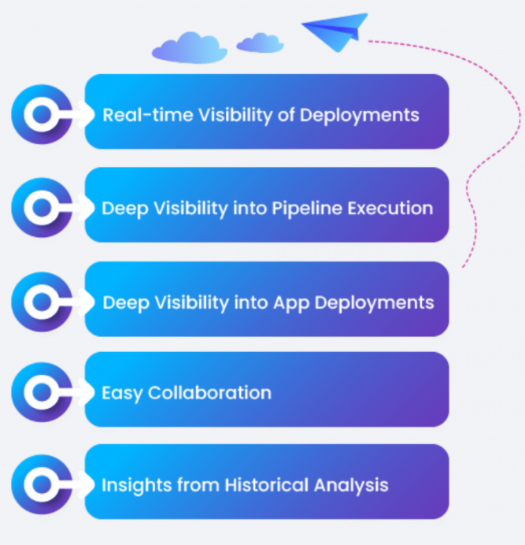

#**Observability**#
The application observability dashboard is a crucial challenge for DevOps engineers, 
SRE, DevSecOps, and engineering managers.  The dashboard provides in-depth information 
about the application and services managed by the platform.  Users can observe details 
about current deployment across all environments (Dev, QA, Staging, and Productions) 
and past deployments.

This feature allows users to collaborate more and make better decisions using real-time 
visibility and deep insights across the software deployments and delivery. It supports 
real-time observability with respect to deployments and pipeline execution and traceability 
for all software delivery events, including what is getting delivered, who approved the 
release, and when it was approved.

##**Overview**##

​​Following are the key benefits of the observability feature:

* Identify and remove bottlenecks in all your pipelines through customizable Application 
and Delivery dashboards. Improve security by rapidly tracing the use of any artifact that 
has vulnerabilities or other issues. Share best practices and identify problem areas across 
your entire software delivery environment.

* Enable developers to monitor applications during and after deployment to production, 
with the ability to detect issues and request for rollback quickly to avoid disruptions.

* Get a high-level view of thousands of pipelines through a single-dashboard to ensure that 
it is operational feasible and receive diagnosis based on historical information.

 

