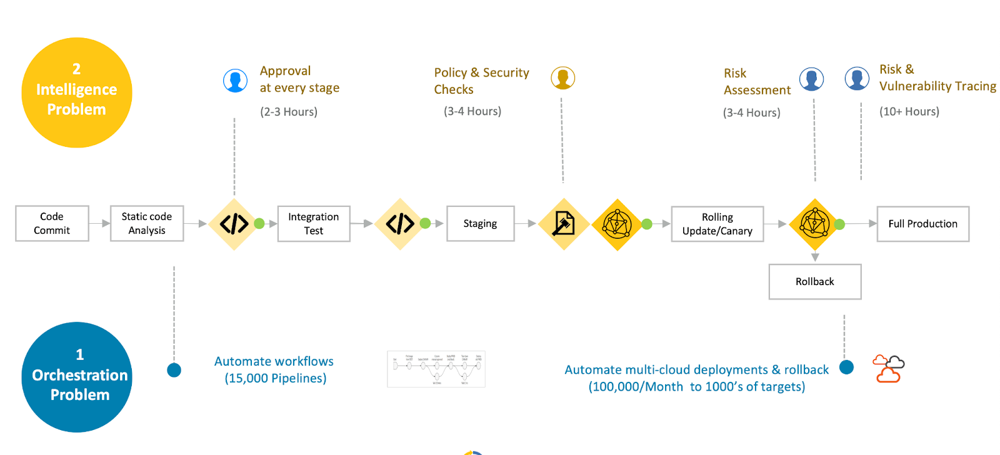
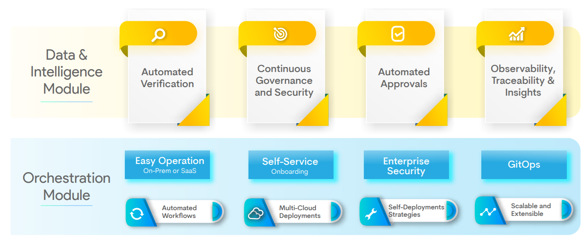

#**Overview**#

##**A quick history:**##
As customers are growing to demand faster, higher quality services, modern businesses are growing to adopt cloud 
native architecture, modernized continuous delivery and infrastructure automation for their services. By breaking 
up otherwise large and monolithic applications into smaller, containerized, microservices, organizations can 
release a higher volume of smaller changes thereby rapidly increasing the quality and scalability of their applications 
to serve more customers with a better application overall.

However, creating a system for secure and continuous application delivery that scales for multiple cloud environments 
is a daunting task even for organizations that can afford to hire the best engineers on the market. Oftentimes those 
teams will be stretched thin as organizations scale their cloud development infrastructure. As Organizations add more 
code bases and services, the risk and complexity of this task will only increase.

##**Overview**##
To tackle this problem, OpsMx has created the intelligent software delivery system (ISD). The goal is simple: eliminate 
human intervention from the software delivery process. And get your application released faster, safer and more secure 
than before. The ISD is highly scalable and leverages Spinnaker for multi-cloud orchestration.  Its modular architecture 
gives you the choice of full-stack deployment automation with Spinnaker or extending your current CD platform with ISD’s 
Intelligence and Data module.

###**ISD consists of the following two modules:**###

* ###**OpsMx Enterprise for Spinnaker (OES):** 
OES is the C module that simplifies the difficulty of orchestrating the 
end-to-end process workflow from code-checking to safe multi-cloud deployments.

* ###**OpsMx Autopilot:** 
OpsMx Autopilot is the Data & Intelligence module that provides insightful data-driven risk 
verification, policy enforcement, and approvals to ensure quality, risk-free and compliant software in production.

###**Key Benefits**###
* Accelerate the velocity of software delivery by replacing manual scripts with automated workflows that scale across 
multi-cloud environments.

* Release software safely and reliably by deploying applications quickly and safely using Canary or Blue-Green.

* Make data-driven decisions across all stages of a deployment pipeline.

* Minimize risk of production failures by automatically determining the risk of every software before moving it to 
production.

* Ensure security and compliance by mitigating risk and vulnerabilities through policy enforced pipelines.

* Remove maintenance and operations burden with the OpsMx ISD which is also available in SaaS option.

ISD consists of the following two modules.

Hyper link_internal

Hyper link_internal
 

