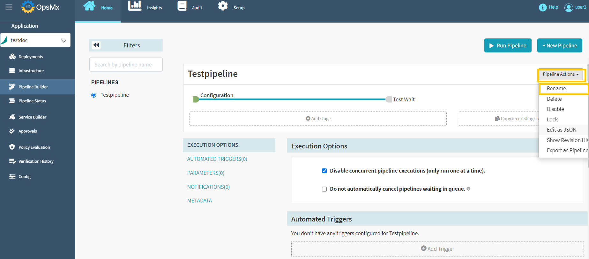
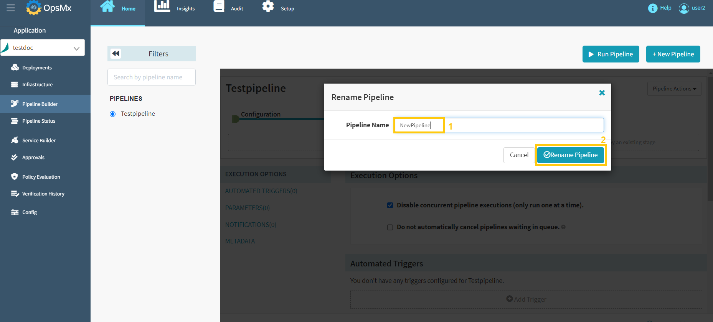
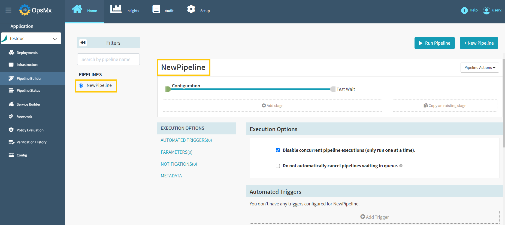

#**Rename Pipeline**#

Follow the steps below to rename a pipeline.

1. Click on your application from the application dashboard and click "**Pipeline Builder**" and **select your pipeline** and then click "**Pipeline Action**" drop-down button.

	

2. Select "**Rename**" option from the **Pipeline Actions** drop-down menu as shown below.

	

3. Below screen will appear to rename your pipeline. Provide your **new pipeline name** and click "**Rename Pipeline**" button to save your changes.

	

4. New pipeline name has been reflected in the application as shown in the image below.

	