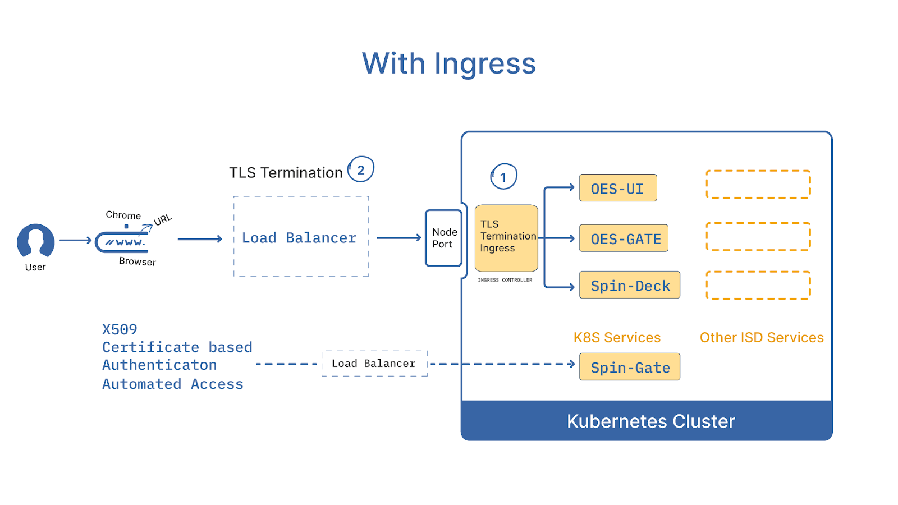
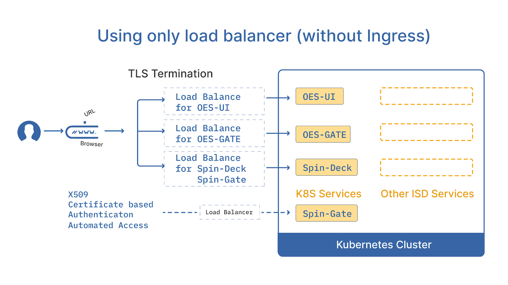

#**Routing Web URLs to ISD services**#

##**Routing Web URLs to ISD services**##

Intelligent Software Deliver (ISD) is a web-application used for state-of-the-art DevOps Delivery. 
It is accessed using a web browser such as Chrome, Safari, etc. and it allows you to build, deploy and 
manage web applications to multiple cloud providers. This document describes various options for routing 
the web traffic from the browser to the ISD services.

###**Summary of terminologies**###

* **URL:** This is a string we type in the browser to access any web-application via a network connected laptop/computer. It consists of 3 main components: http/https (secure http), host-name and path. For example, [https://opsmx.com/contac](https://opsmx.com/contac) consists of the host “opsmx.com” (“where to go”), and “/contact” (where specifically in the site).

* **DNS:** Domain Name service/server, that translates the “host name” component of the URL into an “IP” address, a 4-byte number, as all network devices understand only an IP address.

* **Load Balancer:** This is the entry point of all network traffic into the Cloud/On-prem system.

* **Kubernetes cluster:** This is an isolated environment for running various services (typically microservices) that together make an application. ISD is an application consisting of 10-20 micro-services depending on the configuration.

* **Kubernetes service:** Kubernetes(AKA Kubernetes) has defined “service” as an object that is a fixed end-point for network traffic. The service forwards the traffic to the appropriate micro-services.

* **Ingress:** It is a k8s object that specifically defines “how” traffic is to be routed based on the URL typed by the user, such as the hostname and path components of the URL.

* **Ingress Controller:** This is the application that honors the “Ingress” objects created in the cluster i.e it actually handles the network traffic routing based on the directions given in the Ingress Object. Generally, only one Ingress Controller is required for one Kubernetes cluster.

* **NodePort:** This is a network port that allows external traffic into the kubernetes cluster. This is generally not required unless we have on-prem hardware.(The Nodeport allows external traffic into the Kubernetes cluster. This is generally not needed unless we are installing ISD on-prem).

* **TLS Termination:** When using a httpS (secure) protocol, all network traffic is encrypted and decrypted using “certificates”. Backend services do NOT use httpS. They use the less secure “http” as all the traffic is with-in the cluster and the cluster network is assumed to be trusted. Hence, the incoming traffic from the browser (httpS) needs to be decrypted and forwarded to backend services as http. Similarly, reverse traffic (response) needs to be encrypted before sending to the browser. This process is called TLS termination.

###**ISD Routing Options**###

###**Considerations**###

ISD requires 3 end-points, i.e URLs that can reach the application services. Which of the 2 options are used in an installation depends on the following:

* TLS Certificates: httpS configuration requires generating TLS certificates that contain the “host name” component of the URL. Depending on your organisations’ security policy, these certificates may need to be generated in a certain way and TLS termination to be done in a certain way. Options are:

	* Install cert-manager, a free application that dynamically generates certificates as required. Default ISD installation assumes cert-manager to be installed in the cluster. Note that, for this to work, ISD needs to be reachable from the internet i.e. if you have a private corporate network, this may not be an option.

	* Generate certificates using your companies infrastructure team’s process, if available.

	* **For POV/Trial only,** use http installation, (not httpS). Note that this might not be allowed by your company policy and may result in other security issues.

	* Use self-signed certificates. For this to work, your laptop should have permissions to add a “Certificate Authority” or CA, and is generally allowed in most companies except large corporations that issue company-imaged laptops to employees.

* **DNS:** The URL typed into the browser needs to be translated into an IP address.In other words, users must have a DNS server like godaddy, AWS, route53 or cloudfare.

	* **During a POV/Trial only,** In the event no DNS service is available, users can manually add host-entries in the laptop(s) that are being used to access the application. However, this is a last resort option.

* **Ingress Controller:** ISD default installation uses an Nginx ingress controller, which is very popular and scalable. We at OpsMx recommend this approach. Note that installing an Nginx Ingress controller requires one LoadBalancer to route the network traffic from the user to the k8s cluster, which is automatically created in most clouds. Cloud-provided ingressions may also be used.

* **LoadBalancer(LB):** Most people with AWS/GCP/Azure are experienced in routing traffic from LBs to k8s backend services.This may be the only option depending on the environment used and comfort level of the team-members.

* **TLS Termination:** Depending on the model used, TLS can be terminated either at the Loadbalancer(s) or at the Nginx Ingress controller. The default installation assumes TLS termination at the Nginx Ingress controller.

