#**Trial User Guide**#

##**Login ISD Instance**##

1. This is your ISD Trial Instance's login page. Enter the User ID and Password that you received via email.

	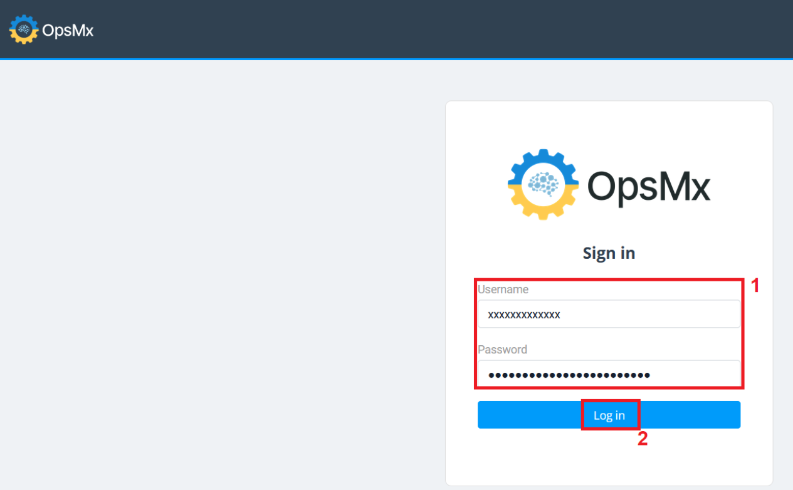

	!!! Note 
            **If you have any issues, please contact us at opsmxsaashelp@opsmx.io.**

2. After you log in you will see the Application Dashboard (refer to the screenshot below).

	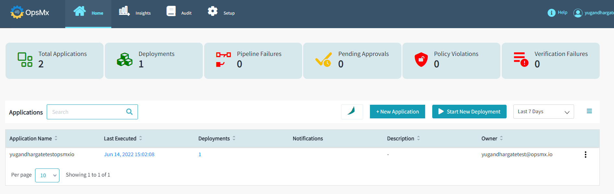

##**ISD SaaS Trial Workflow**##

###**Application Dashboard**###
We have created a sample application for you since this is a Trial version. It comes with a pre-configured 
pipeline that allows you to deploy a sample image directly into a target Kubernetes cluster. 
To do so, follow the steps below:

1. After your successful login, the Application Dashboard appears and it gives you high-level overviews 
of your applications, pipelines along with the following important operational information:

	* **Total Applications** - The number of applications which you have access to

	* **Deployments** - The total number of deployments, from all the applications which you have access to

 	* **Pipeline Failures** - Any pipeline failures, in any of the applications which you have access to 

 	* **Pending Approvals** - Any approvals which are pending for your action

 	* **Policy Violations** - Any policy violations, in any of the applications which you have access to 

 	* **Verification Failures** - Any failures in the verification process within the applications which you have access to

	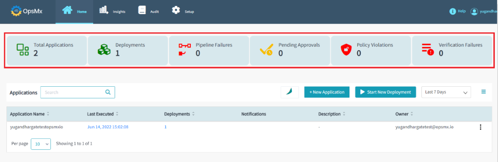

	!!! Note "**As seen in the above image, the total application count is 1. This means, you have access to only one application is the sample application we created for you in this ISD instance.**"

2. To get a detailed view of your application, click on your application name. 
It will redirect you to the "**Pipeline Builder**" page and it displays the pipeline(s) and the gate(s) within your application.

    By default, your application comes with one pipeline called "**K8sdeploydemo**" and two gates, one is an "**Approval**” gate 
and the other is a “**Policy**” gate.

	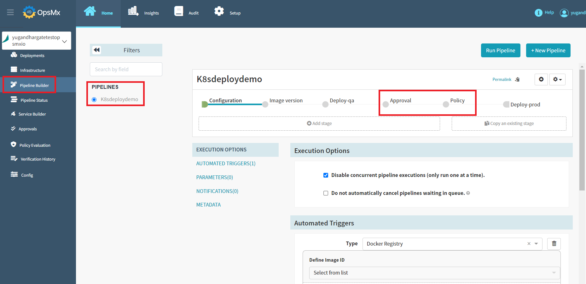

!!! Note "**To know more about Application Dashboard, refer [here](https://docs.opsmx.com/products/data-and-intelligence-module-autopilot/observability/application-dashboard), and to know more about Gates, refer [here](https://docs.opsmx.com/quickstart-guide/manage-pipelines/add-intelligent-gates-to-the-pipeline).**"

##**Application Deployment**##

1. To trigger the deployment of a particular pipeline of your application, click the “**Start New Deployment**” button.

	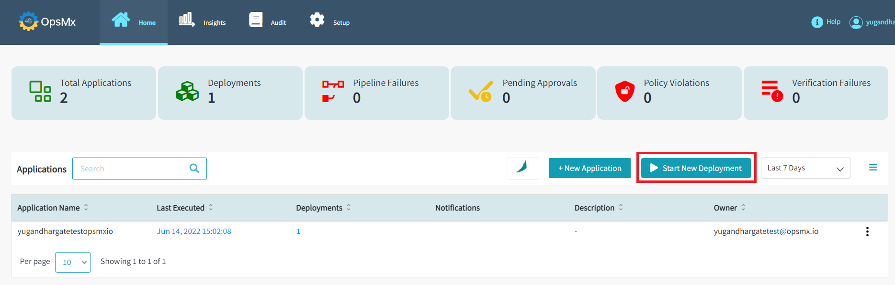

2. In the "**Start New Deployment**" window, update the following parameters using the drop-down options.

	* **Application** - This drop down lists all the applications you have access to. Select the application for 
which you are triggering the execution of the pipeline.

	* **Service/Pipeline** - This drop down lists the pipeline for that application selected above. 
Select the pipeline which you intend to execute.
 
	* **Trigger** - Will be updated automatically
 
	* **Type** - Select the type as Tag or Digest
 
	* **Tags** - Select the tags as v1 or v2 or v3

	Note: For the sample application that comes bundled with this trial instance of ISD, 
since you have access to one application and the drop-down menu only displays that application.

	

3. If you want to be notified by email when the pipeline execution is completed, select the check 
box "Notify me when the pipeline completes" and enter your email address. And then click the “**Run**” 
button to start your deployment.

	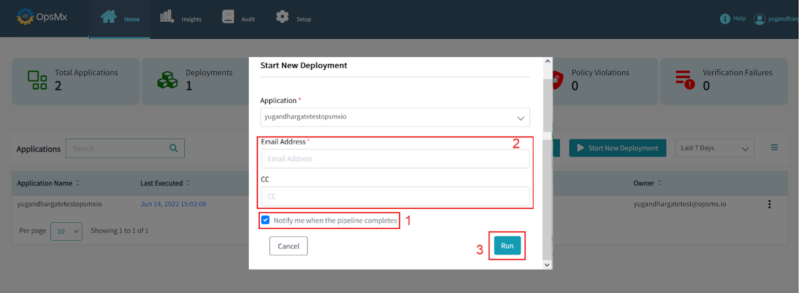

	!!! Note "**To know more about Deployment, refer [here](https://docs.opsmx.com/quickstart-guide/manage-pipelines/run-deployments-execute-pipelines).**"

4. After clicking on the “Run” button, It immediately triggers the execution of the pipeline and starts 
deploying the sample ImageID into the sample Kubernetes cluster. Both the sample image & the Kubernetes 
cluster comes bundled along with the trial instance of ISD.

	You'll be taken to the pipeline execution page, where you can see the pipeline's execution as it progresses 
from one stage to another. This pipeline has five stages as shown below:

	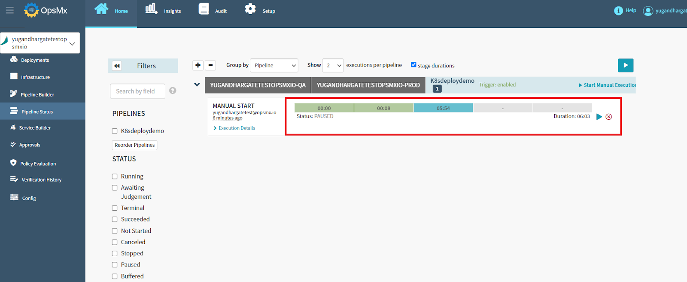

5.  If you click the "**Pause**" button, your pipeline execution will be paused, and it will come to a halt at 
the specified stage.

	

6.  Click on the “**Resume execution**” button to continue your pipeline execution.

	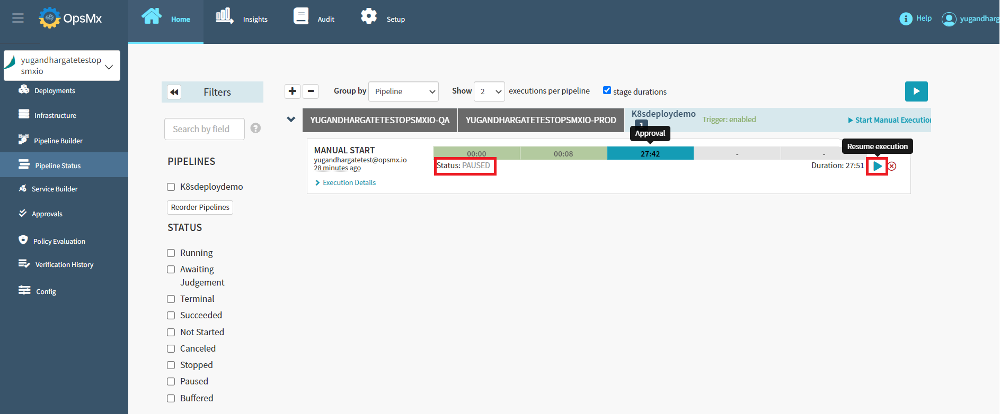

7. To see the pipeline view, click on the "**Pipeline Builder**" button.

	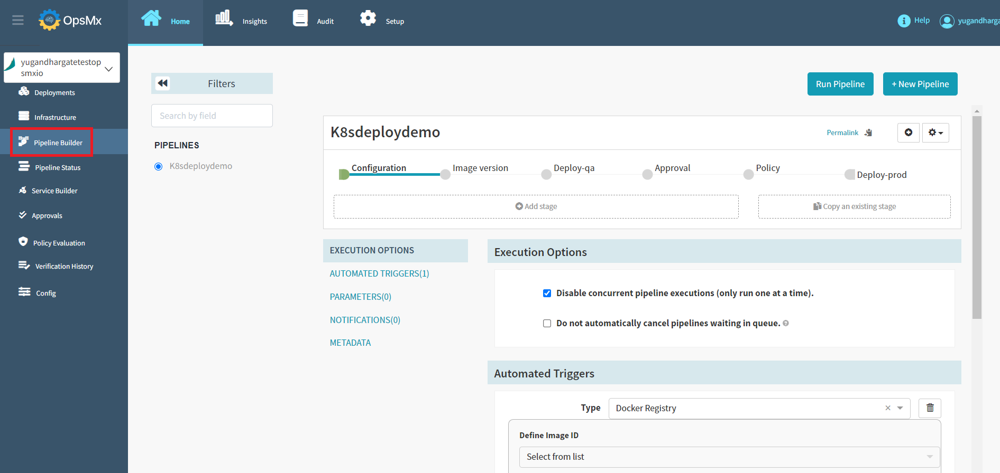

8. The pipeline view shows the various stages of the pipeline and the parameters.

	You can modify the parameters on this page, but we suggest leaving them alone since this is a 
trial version of sample application.

	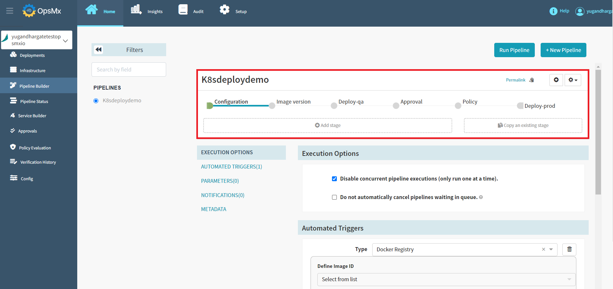

	!!! Note "**To know more about the pipeline, [here](https://docs.opsmx.com/quickstart-guide/manage-pipelines/run-deployments-execute-pipelines).**"

9. Once the pipeline has been executed, your approval gate will be waiting for you to approve or reject it. 
Click on "**Approval**" stage and then click "**Approval Request**" to approve or reject the approval gate.

	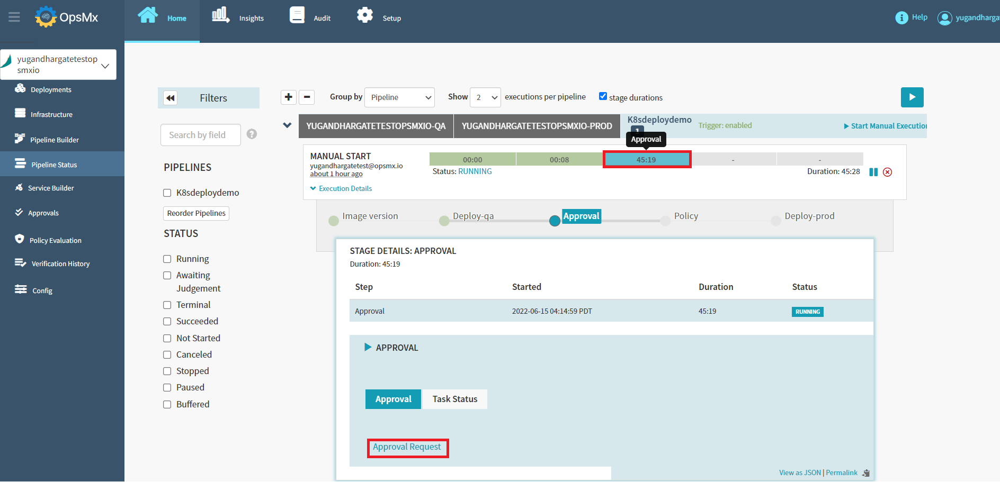

10. Click on the "**Git Repo**" file to see the configured parameters.
	
	This page displays the Application name, Pipeline name, Gate details, and the configured repository details. 
In this case approval gate is configured with Git Repository. 

	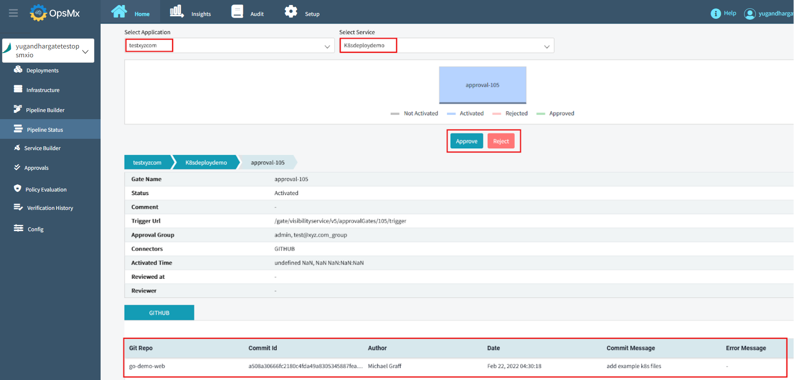

11. You can check the parameters and approve the gate if everything looks good. If not, you have the option 
to reject it.

	

12. Click the “**Approve**” or “**Reject**” button. You have the option to provide comments when approving or 
rejecting the gate.

	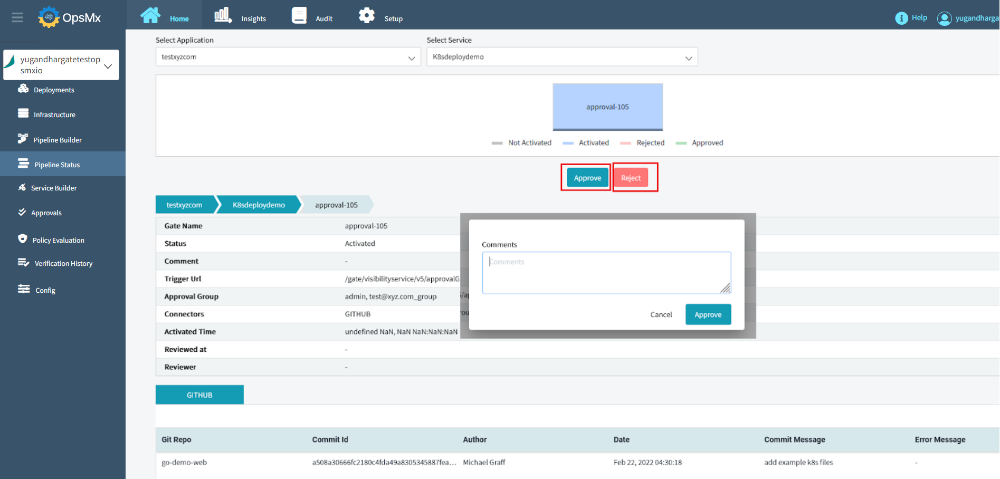

	!!! Note
        * **If the specified gate is approved, the pipeline execution will proceed to the next stage.**
    	* **If the specified gate is rejected, the pipeline will come to a halt.**

13. Your application's deployment has been completed successfully. As shown in the image below, there are no 
pending approvals, policy violations, or verification failures.

	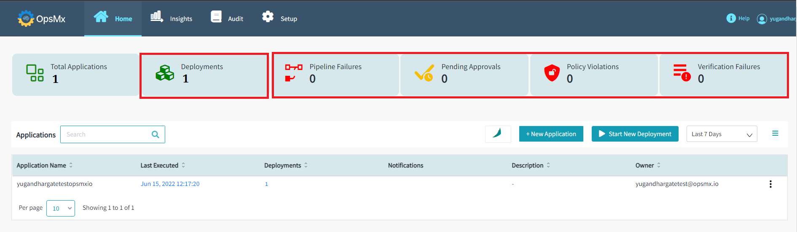

14. The details can also be found on the pipeline execution page, as all of the stages have been completed successfully.

	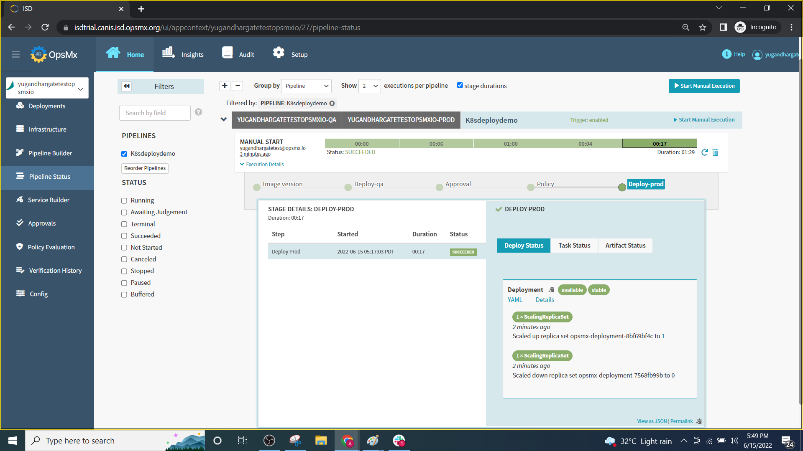

###**Application Deployment Report**###
After your application deployment, you can see the Deployment report.

1. Click on “**Deployments**” to see the Application deployment details and the history.

	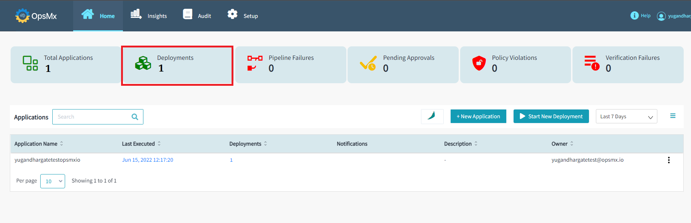

2.  You can see the Application deployment details, such as the number of environments, pipeline, deployment time, 
initiate by, ImageID, and their status as shown in the image below.

	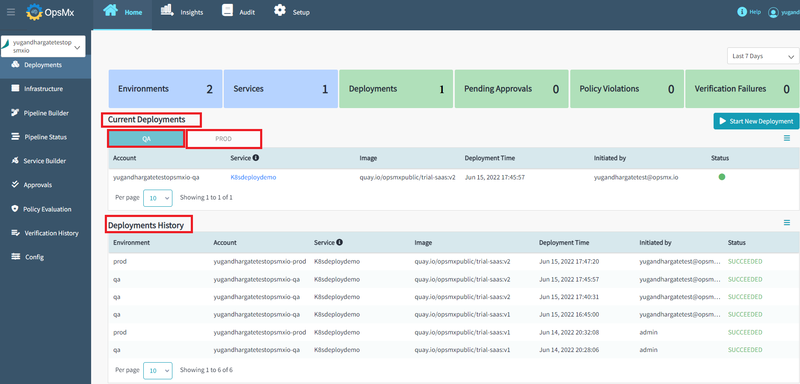

In the ISD SaaS Trial instance, users can create an Application, Integration, Policy, and Agents. 
To learn how to create, click on the links below.

* [Application](https://docs.opsmx.com/quickstart-guide/manage-applications/create-an-application)
* [Integration](https://docs.opsmx.com/quickstart-guide/configure-integrations/add-integrations)
* [Policy](https://docs.opsmx.com/quickstart-guide/manage-policy/create-policy)
* [Agent](https://docs.opsmx.com/quickstart-guide/agent-configuration/add-a-new-agent)

!!! Note "**Cloud Providers are restricted for ISD SaaS Trial users.**"
 

