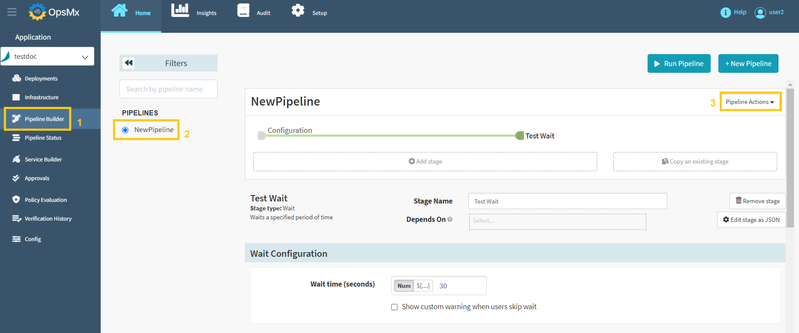
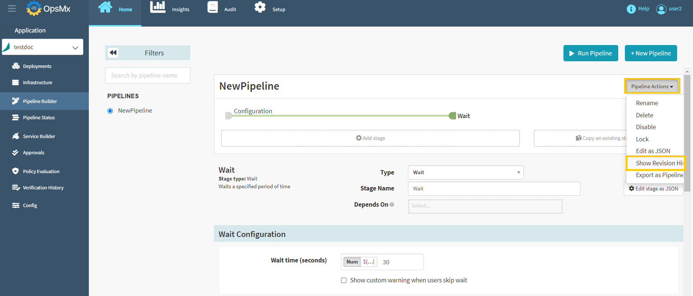
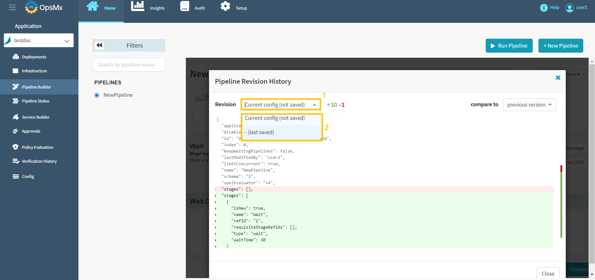
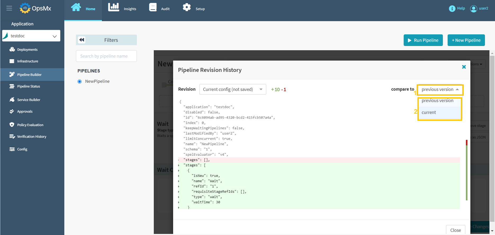
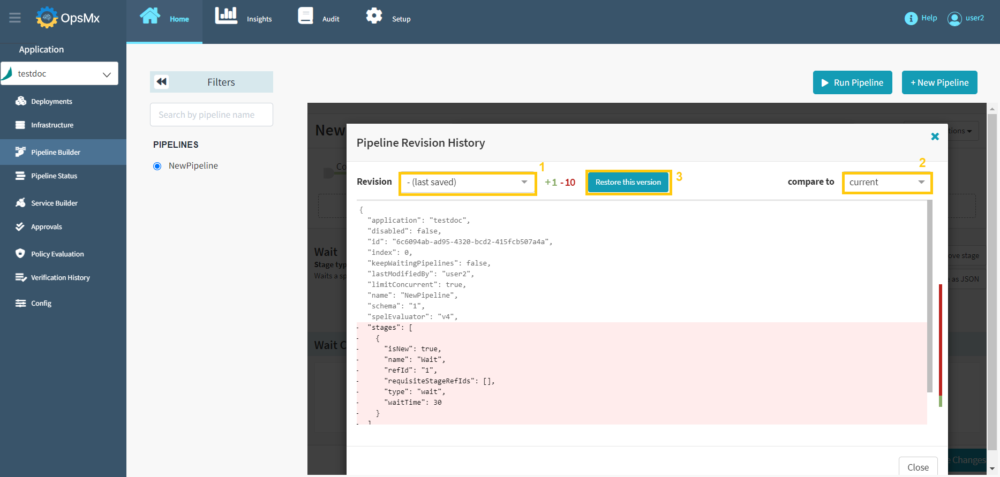

#**View and Restore Pipeline**#

##**Viewing and Restoring Pipeline Versions**##

Whenever you make a change and save the pipeline, a new version is created and added to the version history. You can view the version history and if necessary, restore an older version.

!!! Note
   	Version history is not supported in Minio or Redis storage devices. 

Follow the steps below to view and restore the versions:

1. Click your application from the application dashboard and click "**Pipeline Builder**" and **select your pipeline** and then click "**Pipeline Action**" drop-down button.

	

2. Select "**Show Revision History**" option from the **Pipeline Actions** drop-down menu as shown below.

	

3. A window appears, displaying the current version's JSON representation. Click the **Revision** from drop-down to see the older versions as shown below. 

	

4. If you want to compare to any version, select the **compare to** from drop-down menu as shown below.

	

5.  A button appears after you select a version from the **Revision** drop-down menu. Click the **Restore this version** button to restore that particular version as shown below.

	