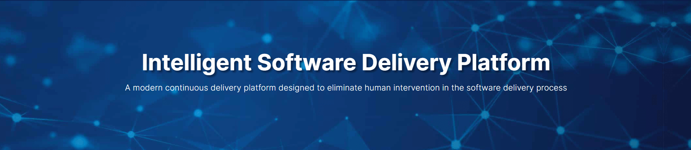

#Home

# **Welcome to OpsMx Documentation**
In this documentation, we will learn about the different products of OpsMx which helps to make your product release 
process smooth and hassle free. In the upcoming sections, we will learn about the installation process and also how 
to use the different features of the products in detail.
The products are as follows:

* [OpsMx Intelligent Software Delivery Platform](OpsMx Intelligent Software Delivery Platform.md)
* Orchestration Module - OpsMx Enterprise for Spinnaker (OES)
* [Data and Intelligence Module - Autopilot](Data and Intelligence Module - Autopilot.md)
